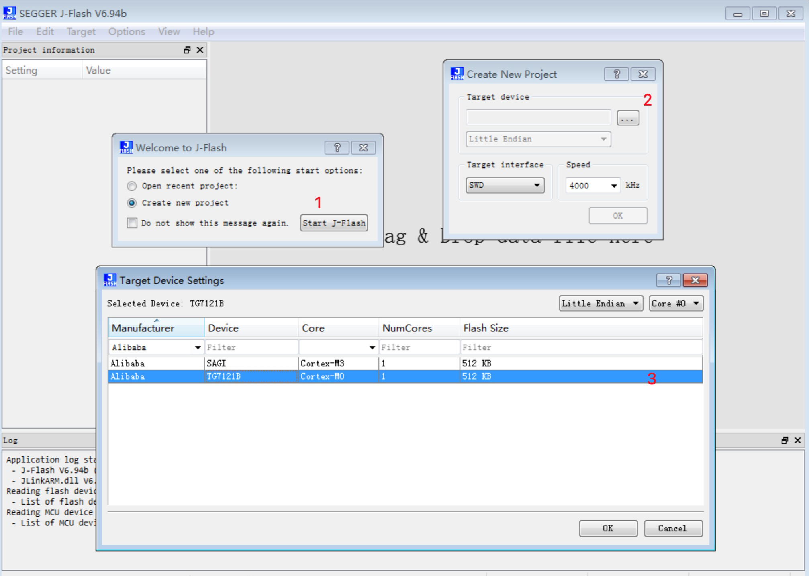

## Change log

无

## 1. 概述

TG7121B板级配置组件。包括TG7121B开发板Pin脚定义，固件生成脚本, 分区定义。

## 2. 组件安装

```bash
yoc init
yoc install TG7121B_evb
```

## 3. 配置

配置文件：package.yaml

| 宏定义名称                        | 功能说明                    | 备注                                   |
| ------------------------------- | -------------------------- | ------------------------------------- |
| CONFIG_MANTB_VERSION            | 定义MANTB版本               |                                       |
| CONFIG_KERNEL_TIMER_MSG_NUM     | 定义内核定时器数量            |                                       |
| BOARD_TG7121B_EVB               | 定义TG7121B_EVB开           |                                       |
| CONFIG_MAX_PARTITION_NUM        | 定义最大分区数               |                                       |
| NDEBUG                          | 关闭调试信息和log            |  默认为1，即关闭日志                     |
| SYSINFO_PRODUCT_MODEL           | 定义产品模型                 |  默认为"TG7121B"                       |
| CONFIG_INIT_TASK_STACK_SIZE     | 定义INIT TASK栈大小         |                                       |
| CONFIG_KERNEL_TIMER_STACK_SIZE  | 定义TIMER TASK栈大小        |                                       |
| CLI_CONFIG_STACK_SIZE           | 定义CLI TASK栈大小          |                                       |
| CONFIG_IDLE_TASK_STACK_SIZE     | 定义IDLE TASK栈大小         | 单位 words                             |
| CONFIG_UART_RECV_BUF_SIZE       | 定义串口接收缓冲区大小        |                                       |
| CONFIG_AIS_TOTAL_FRAME          | 天猫精灵OTA可连续传输包数     | 受限于资源，TG7121B上设置为4，比默认值16要小|
| CONFIG_BT_RX_STACK_SIZE         | 定义RX TASK栈大小           |                                       |
| CONFIG_BT_ADV_STACK_SIZE        | 定义ADV TASK栈大小          |                                       |
| CONFIG_BT_HCI_RX_STACK_SIZE     | 定义HCI RX TASK栈大小       |                                       |
| CONFIG_BT_WORK_INDEPENDENCE     | 配置使用独立的Work任务        |                                       | 
| CONFIG_BT_DISCARDABLE_BUF_COUNT | 可丢弃的HCI Event的缓存大小   |                                       |
| CONFIG_BT_AUTO_PHY_UPDATE       | 自动进行PHY更新              |                                       |
| CONFIG_BT_TINYCRYPT_ECC         | 使用tinycrypt ecc           |                                       |
| CONFIG_BT_RX_BUF_LEN            | 蓝牙连接数据接收缓冲长度       |                                       |
| CONFIG_BT_L2CAP_TX_MTU          | 定义L2CAP 发送 MTU大小       |                                       |

**需要注意由于TG7121B内存有限，所以默认关闭了日志打印，即NDEBUG默认为1。**

如果需要打开TG7121B日志打印，需要关闭genie OTA功能，并调整分区表，做如下修改。
1) 在boards/TG7121B_evb/configs/config.yaml中修改如下：
```bash
partitions:
  - { name: init,    address: 0x18000000, size: 0x007000, update: NONE }
  - { name: kv,      address: 0x18007000, size: 0x002000, update: NONE }
  - { name: imtb,    address: 0x18009000, size: 0x002000, update: NONE }
  - { name: prim,    address: 0x1800b000, size: 0x035000, update: FULL }
  - { name: misc,    address: 0x18040000, size: 0x01e000, update: NONE }
  #- { name: prim,    address: 0x1800b000, size: 0x028000, update: FULL }
  #- { name: misc,    address: 0x18033000, size: 0x02b000, update: NONE }
  - { name: stack,   address: 0x1805e000, size: 0x021000, update: NONE }
  - { name: otp,     address: 0x1807f000, size: 0x001000, update: NONE }
```
2) 在components/chip_TG7121B/drivers/aos_hal_flash.c中修改如下：
```bash
static const hal_logic_partition_t app = {
.partition_owner = HAL_FLASH_SPI,
.partition_description = "prim",
.partition_start_addr = 0x1800b000,
.partition_length = 0x35000,
//.partition_length = 0x28000,
.partition_options = PAR_OPT_READ_EN | PAR_OPT_WRITE_EN,
};
static const hal_logic_partition_t misc = {
.partition_owner = HAL_FLASH_SPI,
.partition_description = "misc",
//.partition_start_addr = 0x18033000,
//.partition_length = 0x2b000,
.partition_start_addr = 0x18040000,
.partition_length = 0x1e000,
.partition_options = PAR_OPT_READ_EN | PAR_OPT_WRITE_EN,
};
```
3) 使能日志：在boards/TG7121B_evb/package.yaml中关闭NDEBUG定义。
```bash
    #NDEBUG: 1
```
4) 重新编译固件。
```bash
cd solutions/genie_mesh_light_ctl/
make clean
make SDK=sdk_chip_TG7121B
```
5) 擦除整片flash，再重新烧录固件。
​

**注意：调试完毕后，生产固件需要回退上述修改，重新使能OTA，默认关闭日志打印。**

## 4. 主要接口说明

### 4.1 板级初始化接口

函数名称：void board_init(void)
函数功能：完成开发板串口Pin脚复用、HCI初始化。

### 4.2 引脚定义（SOP封装）
| 编号 | 名称 | 功能        |
| ---- | ---- | ----------- |
| 1    | VDD  | 电源        |
| 2    | PB15 | IO          |
| 3    | PA01 | ADC5/IO     |
| 4    | PB01 | UART1_RX/IO |
| 5    | PB00 | UART1_TX/IO |
| 6    | GND  | 地          |
| 7    | PA02 | ADC6/IO     |
| 8    | PA09 | IO          |
| 9    | PB05 | SWDIO/IO    |
| 10   | PB06 | SWCLK/IO    |
| 11   | PB14 | BOOT_SEL/IO |
| 12   | GND  | 地          |

**注: PB14为启动选择，启动时，检测到高电平，进入串口模式，否则进入正常模式。**

## 5. 开发板烧录

### 5.1 J-Flash烧录

将components\chip_TG7121B\ls_ble_sdk\tools\prog\ 目录下所有内容拷贝到 JLink 安装路径 （如C:\Program Files (x86)\SEGGER\JLink）覆盖原有文件。

配置jflash。

打开对应的j-flash的程序，按如下步骤配置：



然后导入对应的HEX文件进行烧录。

点击File->Open data file...选择要烧录的hex文件,或者直接将文件拖入JFLash中；

选择烧录文件之后，点击Target->Connect,如果能够连接成功会在LOG窗口最后一行显示“Connected successfully”，否则请检查硬件接线是否正确；

点击 Target->Manual Programming->Erase 执行芯片全擦；

点击 Target->Production Programming 开始烧录选中的hex文件。

### 5.2 串口烧录

工具获取：请从OCC芯片开放社区TG7121B芯片主页下载TG7121B的串口烧录工具 tg7121b_download_tool.zip

文件说明：

压缩包内DownloadTool 内工具用于下载用户Image到芯片内。

Config ini配置：

如果对烧录过程有一些配置需求，可打开config.ini 文件自行配置。

操作说明：

（1）断开所有连线，将uart串口工具的RXD Pin接芯片的PB00,TXD Pin接芯片的PB01,3.3V接芯片的VDD，GND接GND，再将芯片的PB14设置成高电平；

（2）将串口工具连接电脑给芯片上电，必须在第一步的接线完成之后再给芯片上电；

（3）打开download.exe，选择固件，导入要下载的hex文件；

（4）下载工具界面选择相应的COM口，默认波特率为460800，也可改成其它，如果下载过程中一直出现校验出错的情况，可以降低波特率重新烧录；

（5）点击打开按钮，打开相应的COM口；

（6）烧录成功之后，下载的进度条为100%，下载状态显示下载完成；

（7）如果烧录失败，在串口工具不掉电的情况下，重新给芯片上电，上位机烧录软件不需要操作；在烧录软件打开串口后，串口工具意外断电，烧录软件上需要关闭串口后再重新打开串口；

（8）去掉PB14的高电平，重新上电或复位便可运行烧录的程序。

## 6.依赖资源
- chip_TG7121B