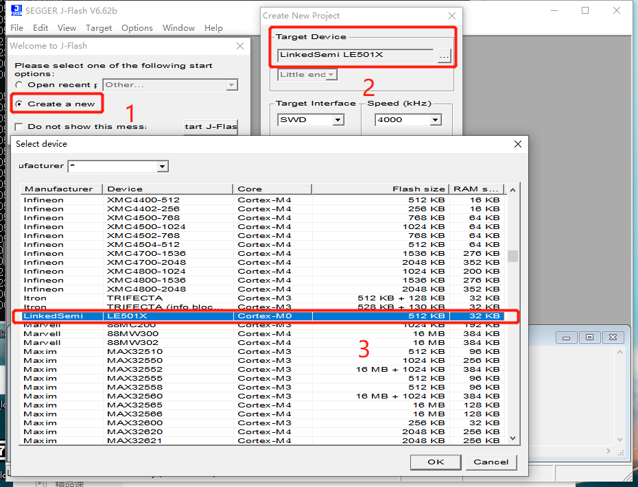

.. _vscode_debug:

VS Code 构建、烧录、调试
========================

构建
-------------

完成 :ref:`env_setup` 操作后，在VS Code中打开SDK **根目录** ，通过快捷键 ``Ctrl + ``` 打开Terminal，执行::

    scons
    
会编译所有示例程序，生成文件保存在SDK ``build/examples/`` 目录下

生成文件
~~~~~~~~~
一般情况，每个示例工程会生成.asm，.elf，.hex，.map四个文件。

**.elf**
    包含调试信息的工程编译链接输出

**.asm**
    由.elf文件导出的反汇编

**.map**
    编译链接生成的符号和交叉引用信息

**.hex**
    由.elf文件导出的Intel Hex格式程序镜像，用于烧录
    
JLINK烧录、调试的准备工作
-------------------------

#. 将JLink安装路径（JFlash.exe 、JLinkGDBServerCL.exe 所在目录） ``{JLINK_SETUP_DIR}`` 添加到系统环境变量PATH。

#. 将SDK ``tools/prog/`` 目录下所有内容拷贝到JLink安装路径 ``{JLINK_SETUP_DIR}`` 覆盖原有文件。

烧录
--------------

根据 :ref:`memory` 一节的介绍，Flash被划分为Info、Second Boot、Image and OTA Image、Persistent Data、Protocol Stack五个区域。
除了Persistent Data区域是运行时写入的数据，其他四个区域都需要预先写入Flash，程序才能正确运行。

**Info + Second Boot**
    build/examples/info_sbl.hex
    
**Protocol Stack**
    dev/soc/arm_cm/le501x/bin/fw.hex

*开发调试* 阶段，需要预先将上述两个hex文件烧录Flash。

*量产* 前，用hexmerge.py将上述两个hex和应用镜像hex合并::

    hexmerge.py build/examples/info_sbl.hex dev/soc/arm_cm/le501x/bin/fw.hex build/examples/myapp.hex > mayapp_production.hex

JFlash使用
~~~~~~~~~~~~~


调试
-------------

打开VS Code调试视图（快捷键 ``Ctrl + Shift + D`` ），可以选择需要调试的程序。

**Debug {example 1}**
    表示复位系统，自动烧录 ``{example 1}`` 应用镜像到Flash中，并从头运行


**Attach {example 1}**
    表示以 ``{example 1}`` 为程序，调试器直接连接到当前运行现场
