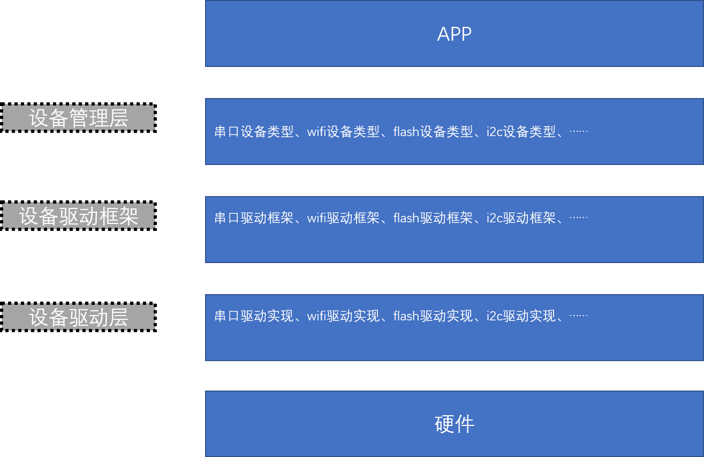

# 设备驱动框架

## 概述

YoC提供了一套简单设备模型框架，用来统一管理设备驱动的核心接口，包括设备的注册，注销，操作等，它位于硬件和应用程序之间，共分成三层，从上到下分别是 `设备管理层`、`设备驱动框架层`、`设备驱动层`。



-  **设备管理层**

实现了对设备驱动程序的封装。应用程序通过管理层的标准接口访问底层设备，设备驱动程序的更改不会对上层应用代码产生影响。从而降低了代码的耦合性、复杂性，提高了系统的可靠性。

- **设备驱动框架层**

同类硬件设备驱动的抽象，将同类硬件设备驱动中相同的部分抽象出来，留出不同部分的接口，由驱动程序实现。

- **设备驱动层**

一组驱使硬件设备工作的程序，实现提供注册及访问硬件设备的功能。

- **使用方式**

设备驱动根据设备模型定义，创建出具备硬件访问能力的设备实例，将该设备通过 `rvm_driver_register()` 接口注册到 设备管理器中。应用程序通过 `rvm_hal_device_find()` 接口查找到设备，然后使用设备管理层接口来访问硬件。

## 接口定义

### 注册设备驱动

```C
int rvm_driver_register(driver_t *drv, void *config, int idx);
```

注册设备驱动。

* 设备驱动结构体


```C
typedef struct _driver_obj driver_t;

struct _driver_obj {
    slist_t node;
    char   *name;
    char   *type;
    int16_t ref;
    int16_t device_id;

    rvm_dev_t * (*init)(driver_t *drv, void *config, int id);
    void    (*uninit)(rvm_dev_t *dev);
    int     (*lpm)(rvm_dev_t *dev, int state);
    int     (*open)(rvm_dev_t *dev);
    int     (*close)(rvm_dev_t *dev);
};
```

* 参数
  * drv：设备驱动结构体指针
  * config：设备配置结构体指针
  * idx：设备ID

* 返回值
  * 0：注册成功
  * -1：注册失败


### 注销设备驱动

```C
int rvm_driver_unregister(const char *name);
```

注销设备驱动。


* 参数
  * name：设备名字

* 返回值
  * 0：注销成功
  * -1：注销失败

### 设备查找

```C
rvm_dev_t *rvm_hal_device_find(const char *name, int id);
```

查找设备。


* 参数
  * name：设备名字
  * id：设备ID

* 返回值
  * NULL：查找失败
  * 非NULL：查找成功，返回设备对象指针

### 分配设备新节点

```c
rvm_dev_t *rvm_hal_device_new(driver_t *drv, int size, int id);
```

为设备分配新节点。

* 参数
  * drv：设备名字
  * size：设备大小
  * id：设备ID

* 返回值
  * NULL：分配失败
  * 非NULL：分配成功，返回设备对象指针

### 释放设备节点

```c
void rvm_hal_device_free(rvm_dev_t *dev);
```

释放设备节点。

* 参数
  * dev：设备结构体指针
* 返回值
  * 无

### 锁住设备

```C
int device_lock(rvm_dev_t *dev);
```

锁住设备防止其他对象对该设备访问。


* 参数
  * dev：设备结构体指针
* 返回值
  * 返回0成功

### 释放设备

```C
int device_unlock(rvm_dev_t *dev);
```

释放设备允许其他对象对该设备访问。


* 参数
  * dev：设备结构体指针
* 返回值
  * 返回0成功

### 判断设备名是否有效

```C
int device_valid(rvm_dev_t *dev, const char *name);
```

判断设备名是否有效。

* 参数
  * dev：设备结构体指针
  * name：设备名字

* 返回值
  * 0：设备名字有效
  * 非0：设备名字无效

### 设备进入或离开lpm

```c
int rvm_hal_device_lpm_enable(rvm_dev_t *dev, int pm_state);
```

设备进入或离开lpm。

* 参数
  * dev：设备结构体指针
  * pm_state：1表示进入lpm；0表示离开lpm。

* 返回值
  * 0：成功
  * 其他值：失败

### 打开设备

```c
rvm_dev_t *rvm_hal_device_open(const char *name);
```

返回设备驱动对象。

* 参数
  * name：设备名字
* 返回值
  * NULL：打开设备失败
  * 非NULL：打开设备成功，返回设备驱动对象指针

### 关闭设备

```c
int *rvm_hal_device_close(const char *name);
```

关闭设备。

* 参数
  * name：设备名字
* 返回值
  * 0：关闭设备成功
  * 非0：关闭设备失败

## 接口实例

```C
//simulate 实现
static sensor_driver_t sensor_driver = {
    .drv = {
        .name   = "simulate",
        .type   = "sensor",
        .init   = yoc_sensor_simu_init,
        .uninit = yoc_sensor_simu_uninit,
        .lpm    = yoc_sensor_simu_lpm,
        .open   = yoc_sensor_simu_open,
        .close  = yoc_sensor_simu_close,
    },
    .fetch      = yoc_sensor_simu_fetch,
    .getvalue   = yoc_sensor_simu_get,
};
//simulate 注册接口
void sensor_simulate_register(void *config, int idx)
{
    rvm_driver_register(&sensor_driver.drv, config, idx);
}
//外部注册并使用simulate设备
static void test_sensor_api(void)
{
    dev_t *sensor;
    rvm_hal_sensor_simulate_t sv;
    int ret;

    sensor_simulate_register(NULL, 0);

    sensor = sensor_open_id("simulate", 0);    //打开“simulate0”设备
    YUNIT_ASSERT(sensor != NULL);

    ret = rvm_hal_sensor_fetch(sensor);
    YUNIT_ASSERT(ret == 0);

    ret = rvm_hal_sensor_getvalue(sensor, (void *)&sv, sizeof(rvm_hal_sensor_simulate_t));
    YUNIT_ASSERT(ret == 0);

    rvm_hal_sensor_close(sensor); 				     //关闭“simulate0”设备
}
```