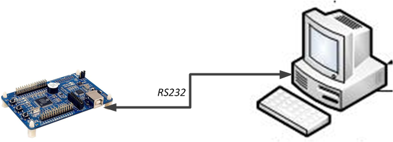
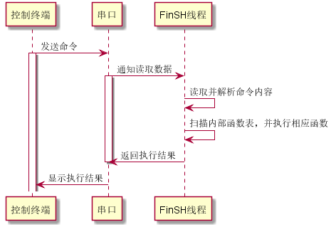

# FinSH 控制台

在计算机发展的早期，图形系统出现之前，没有鼠标，甚至没有键盘。那时候人们如何与计算机交互呢？最早期的计算机使用打孔的纸条向计算机输入命令，编写程序。后来随着计算机的不断发展，显示器、键盘成为计算机的标准配置，但此时的操作系统还不支持图形界面，计算机先驱们开发了一种软件，它接受用户输入的命令，解释之后，传递给操作系统，并将操作系统执行的结果返回给用户。这个程序像一层外壳包裹在操作系统的外面，所以它被称为 shell。

嵌入式设备通常需要将开发板与 PC 机连接起来通讯，常见连接方式包括：串口、USB、以太网、Wi-Fi 等。一个灵活的 shell 也应该支持在多种连接方式上工作。有了 shell，就像在开发者和计算机之间架起了一座沟通的桥梁，开发者能很方便的获取系统的运行情况，并通过命令控制系统的运行。特别是在调试阶段，有了 shell，开发者除了能更快的定位到问题之外，也能利用 shell 调用测试函数，改变测试函数的参数，减少代码的烧录次数，缩短项目的开发时间。

FinSH 是 RT-Thread 的命令行组件（shell），正是基于上面这些考虑而诞生的，FinSH 的发音为 [ˈfɪnʃ]。读完本章，我们会对 FinSH 的工作方式以及如何导出自己的命令到 FinSH 有更加深入的了解。

## FinSH 简介

FinSH 是 RT-Thread 的命令行组件，提供一套供用户在命令行调用的操作接口，主要用于调试或查看系统信息。它可以使用串口 / 以太网 / USB 等与 PC 机进行通信，硬件拓扑结构如下图所示：



用户在控制终端输入命令，控制终端通过串口、USB、网络等方式将命令传给设备里的 FinSH，FinSH 会读取设备输入命令，解析并自动扫描内部函数表，寻找对应函数名，执行函数后输出回应，回应通过原路返回，将结果显示在控制终端上。

当使用串口连接设备与控制终端时，FinSH 命令的执行流程，如下图所示：



FinSH 支持权限验证功能，系统在启动后会进行权限验证，只有权限验证通过，才会开启 FinSH 功能，提升系统输入的安全性。

FinSH 支持自动补全、查看历史命令等功能，通过键盘上的按键可以很方便的使用这些功能，FinSH 支持的按键如下表所示：

|**按键**|**功能描述**  |
|----------|--------------|
| Tab 键    | 当没有输入任何字符时按下 Tab 键将会打印当前系统支持的所有命令。若已经输入部分字符时按下 Tab 键，将会查找匹配的命令，也会按照文件系统的当前目录下的文件名进行补全，并可以继续输入，多次补全 |
| ↑↓键     | 上下翻阅最近输入的历史命令  |
| 退格键   | 删除符                   |
| ←→键     | 向左或向右移动标      |

FinSH 支持命令行模式，此模式又称为 msh(module shell)，msh 模式下，FinSH 与传统 shell（dos/bash）执行方式一致，例如，可以通过 `cd /` 命令将目录切换至根目录。

msh 通过解析，将输入字符分解成以空格区分开的命令和参数。其命令执行格式如下所示：

`command [arg1] [arg2] [...]`

其中 command 既可以是 RT-Thread 内置的命令，也可以是可执行的文件。


## FinSH 内置命令

在 RT-Thread 中默认内置了一些 FinSH 命令，在 FinSH 中输入 help 后回车或者直接按下 Tab 键，就可以打印当前系统支持的所有命令。

msh 模式下，按下 Tab 键后可以列出当前支持的所有命令。默认命令的数量不是固定的，RT-Thread 的各个组件会向 FinSH 输出一些命令。例如，当打开 DFS 组件时，就会把 ls，cp，cd 等命令加到 FinSH 中，方便开发者调试。

以下为按下 Tab 键后打印出来的当前支持的所有显示 RT-Thread 内核状态信息的命令，左边是命令名称，右边是关于命令的描述：

```c
msh />
RT-Thread shell commands:
pin              - pin [option]
reboot           - Reboot System
help             - RT-Thread shell help.
ps               - List threads in the system.
free             - Show the memory usage in the system
clear            - clear the terminal screen
version          - show RT-Thread version information
list             - list objects


msh />list
Usage: list [options]
[options]:
    thread     - list threads
    timer      - list timers
    sem        - list semaphores
    mutex      - list mutexs
    event      - list events
    mailbox    - list mailboxs
    msgqueue   - list message queues
    memheap    - list memory heaps
    mempool    - list memory pools
    device     - list devices
    fd         - list file descriptors
msh />

```

这里列出输入常用命令后返回的字段信息，方便开发者理解返回的信息内容。

### 显示线程状态

使用 ps 或者 list thread 命令来列出系统中的所有线程信息，包括线程优先级、状态、栈的最大使用量等。

```c
msh />list thread
thread   pri  status      sp     stack size max used left tick  error
-------- ---  ------- ---------- ----------  ------  ---------- ---
tshell    20  running 0x00000160 0x00001000    15%   0x00000003 OK
aio      128  suspend 0x00000084 0x00000800    06%   0x0000000a OK
sys work  23  suspend 0x00000084 0x00000800    06%   0x0000000a OK
tidle0   255  ready   0x0000005c 0x00001000    04%   0x00000016 OK
timer      4  suspend 0x00000078 0x00000400    11%   0x00000009 OK
```
list thread 返回字段的描述:

|**字段**  |**描述**                  |
|------------|----------------------------|
| thread     | 线程的名称                 |
| pri        | 线程的优先级               |
| status     | 线程当前的状态             |
| sp         | 线程当前的栈位置           |
| stack size | 线程的栈大小               |
| max used   | 线程历史中使用的最大栈位置 |
| left tick  | 线程剩余的运行节拍数       |
| error      | 线程的错误码               |

### 显示信号量状态

使用 list sem 命令来显示系统中所有信号量信息，包括信号量的名称、信号量的值和等待这个信号量的线程数目。

```c
msh />list sem
semaphor v   suspend thread
-------- --- --------------
shrx     000 0
sem_sd0  001 0
psem     001 0
pmq      001 0
wqueue   000 0
sd_ack   000 0
wqueue   000 0
```

list sem 返回字段的描述:

|**字段**      |**描述**                |
|----------------|--------------------------|
| semaphore      | 信号量的名称             |
| v              | 信号量当前的值           |
| suspend thread | 等待这个信号量的线程数目 |

### 显示事件状态

使用 list event 命令来显示系统中所有的事件信息，包括事件名称、事件的值和等待这个事件的线程数目。

```c
msh />list event
event      set    suspend thread
-----  ---------- --------------
```

list event 返回字段的描述:

|**字段**      |**描述**                        |
|----------------|----------------------------------|
| event          | 事件集的名称                     |
| set            | 事件集中当前发生的事件           |
| suspend thread | 在这个事件集中等待事件的线程数目 |

### 显示互斥量状态

使用 list mutex 命令来显示系统中所有的互斥量信息，包括互斥量名称、互斥量的所有者和所有者在互斥量上持有的嵌套次数等。

```c
msh />list mutex
mutex      owner  hold suspend thread priority
-------- -------- ---- -------------- --------
fat0     (NULL)   0000 0              255
sd_bus_l (NULL)   0000 0              255
fdlock   (NULL)   0000 0              255
fslock   (NULL)   0000 0              255
dfs_mgr  (NULL)   0000 0              255
heap     (NULL)   0000 0              255
```

list mutex 返回字段的描述:

|**字段**      |**描述**                          |
|----------------|------------------------------------|
| mutxe          | 互斥量的名称                       |
| owner          | 当前持有互斥量的线程               |
| hold           | 持有者在这个互斥量上嵌套持有的次数 |
| suspend thread | 等待这个互斥量的线程数目           |
| priority | 持有线程的优先级 |

### 显示邮箱状态

使用 list mailbox 命令显示系统中所有的邮箱信息，包括邮箱名称、邮箱中邮件的数目和邮箱能容纳邮件的最大数目等。

```c
msh />list mailbox
mailbox  entry size suspend thread
-------- ----  ---- --------------
mmcsdhot 0001  0004 0
mmcsdmb  0000  0004 1:mmcsd_de
```

list mailbox 返回字段的描述:

|**字段**      |**描述**                  |
|----------------|----------------------------|
| mailbox        | 邮箱的名称                 |
| entry          | 邮箱中包含的邮件数目       |
| size           | 邮箱能够容纳的最大邮件数目 |
| suspend thread | 等待这个邮箱的线程数目 |

### 显示消息队列状态

使用 list msgqueue 命令来显示系统中所有的消息队列信息，包括消息队列的名称、包含的消息数目和等待这个消息队列的线程数目。

```c
msh />list msgqueue
msgqueue entry suspend thread
-------- ----  --------------
```

list msgqueue 返回字段的描述:

|**字段**      |**描述**                  |
|----------------|----------------------------|
| msgqueue       | 消息队列的名称             |
| entry          | 消息队列当前包含的消息数目 |
| suspend thread | 等待这个消息队列的线程数目 |

### 显示内存池状态

使用 list mempool 命令来显示系统中所有的内存池信息，包括内存池的名称、内存池的大小和最大使用的内存大小等。

```c
msh />list mempool
mempool block total free suspend thread
------- ----  ----  ---- --------------
signal  0012  0032  0032 0
```

list mempool 返回字段的描述:

|**字段**      |**描述**          |
|----------------|--------------------|
| mempool        | 内存池名称         |
| block      | 内存块大小         |
| total  | 总内存块 |
| free | 空闲内存块 |
| suspend thread | 等待这个内存池的线程数目 |

### 显示定时器状态

使用 list timer 命令来显示系统中所有的定时器信息，包括定时器的名称、是否是周期性定时器和定时器超时的节拍数等。

```c
msh />list timer
timer     periodic   timeout    activated     mode
-------- ---------- ---------- ----------- ---------
tshell   0x00000000 0x00000000 deactivated one shot
aio      0x00000000 0x00000000 deactivated one shot
mmcsd_de 0x00000001 0x0000000d deactivated one shot
sys work 0x00000000 0x00000000 deactivated one shot
tidle0   0x00000000 0x00000000 deactivated one shot
timer    0x00000000 0x00000000 deactivated one shot
current tick:0x00017c0d
```

list timer 返回字段的描述:

|**字段**|**描述**                                |
|----------|--------------------------------|
| timer    | 定时器的名称                                               |
| periodic | 定时器是否是周期性的                                       |
| timeout  | 定时器超时时的节拍数                                       |
| activated | 定时器的状态，activated 表示活动的，deactivated 表示不活动的 |
| mode | 定时器类型，one shot 表示单次定时，periodic 表示周期定时 |

current tick 表示当前系统的 tick 数。

### 显示设备状态

使用 list device 命令来显示系统中所有的设备信息，包括设备名称、设备类型和设备被打开次数。

```c
msh />list device
device           type         ref count
-------- -------------------- ----------
sd       Block Device         1
rtc      RTC                  0
zero     Miscellaneous Device 0
shm      Unknown              0
uart1    Character Device     0
uart0    Character Device     2
```

list device 返回字段的描述:

|**字段** |**描述**      |
|-----------|----------------|
| device    | 设备的名称     |
| type      | 设备的类型     |
| ref count | 设备被打开次数 |

### 显示动态内存状态

使用 free 命令来显示系统中所有的内存信息。

```c
msh />free
total    : 66606976
used     : 17792
maximum  : 20000
available: 66589184
```

free 返回字段的描述:

|**字段**                |**描述**        |
|--------------------------|------------------|
| total memory             | 内存总大小       |
| used memory              | 已使用的内存大小 |
| maximum allocated memory | 最大分配内存     |
| available | 可用内存大小 |

## 自定义 FinSH 命令

除了 FinSH 自带的命令，FinSH 还也提供了多个宏接口来导出自定义命令，导出的命令可以直接在 FinSH 中执行。

### 自定义 msh 命令

自定义的 msh 命令，可以在 msh 模式下被运行，将一个命令导出到 msh 模式可以使用如下宏接口：

`MSH_CMD_EXPORT(name, desc);`

|**参数**|**描述**      |
|----------|----------------|
| name     | 要导出的命令   |
| desc     | 导出命令的描述 |

这个命令可以导出有参数的命令，也可以导出无参数的命令。导出无参数命令时，函数的入参为 void，示例如下：

```c
void hello(void)
{
    rt_kprintf("hello RT-Thread!\n");
}

MSH_CMD_EXPORT(hello , say hello to RT-Thread);
```

导出有参数的命令时，函数的入参为 `int argc` 和 `char**argv`。argc 表示参数的个数，argv 表示命令行参数字符串指针数组指针。导出有参数命令示例如下：

```c
static void atcmd(int argc, char**argv)
{
    ……
}

MSH_CMD_EXPORT(atcmd, atcmd sample: atcmd <server|client>);
```

### 自定义命令重命名

FinSH 的函数名字长度有一定限制，它由 finsh.h 中的宏定义 FINSH_NAME_MAX 控制，默认是 16 字节，这意味着 FinSH 命令长度不会超过 16 字节。这里有个潜在的问题：当一个函数名长度超过 FINSH_NAME_MAX 时，使用 FINSH_FUNCTION_EXPORT 导出这个函数到命令表中后，在 FinSH 符号表中看到完整的函数名，但是完整输入执行会出现 null node 错误。这是因为虽然显示了完整的函数名，但是实际上 FinSH 中却保存了前 16 字节作为命令，过多的输入会导致无法正确找到命令，这时就可以使用 FINSH_FUNCTION_EXPORT_ALIAS 来对导出的命令进行重命名。

`FINSH_FUNCTION_EXPORT_ALIAS(name, alias, desc);`

|**参数**|**描述**               |
|----------|-------------------------|
| name     | 要导出的命令            |
| alias    | 导出到 FinSH 时显示的名字 |
| desc     | 导出命令的描述          |

在重命名的命令名字前加 `__cmd_` 就可以将命令导出到 msh 模式，否则，命令会被导出到 C-Style 模式。以下示例定义了一个 hello 函数，并将它重命名为 ho 后导出成 C-Style 模式下的命令。

```c
void hello(void)
{
    rt_kprintf("hello RT-Thread!\n");
}

FINSH_FUNCTION_EXPORT_ALIAS(hello , ho, say hello to RT-Thread);
```
## FinSH 功能配置

FinSH 功能可以裁剪，宏配置选项在 rtconfig.h 文件中定义，具体配置项如下表所示。

|**宏定义** |**取值类型**|**描述** |**默认值**|
|------------------------|----|------------|-------|
| #define RT_USING_FINSH   | 无      | 使能 FinSH  | 开启       |
| #define FINSH_THREAD_NAME  | 字符串 | FinSH 线程的名字   | "tshell"   |
| #define FINSH_USING_HISTORY   | 无  | 打开历史回溯功能  | 开启       |
| #define FINSH_HISTORY_LINES | 整数型   | 能回溯的历史命令行数 | 5|
| #define FINSH_USING_SYMTAB | 无 | 可以在 FinSH 中使用符号表 | 开启       |
|#define FINSH_USING_DESCRIPTION | 无 | 给每个 FinSH 的符号添加一段描述 | 开启 |
| #define FINSH_USING_MSH| 无 | 使能 msh 模式  | 开启 |
| #define FINSH_ARG_MAX  | 整数型 | 最大输入参数数量   | 10         |
| #define FINSH_USING_AUTH  | 无   | 使能权限验证  | 关闭       |
| #define FINSH_DEFAULT_PASSWORD  | 字符串 | 权限验证密码  | 关闭       |

rtconfig.h 中的参考配置示例如下所示，可以根据实际功能需求情况进行配置。

```c
/* 开启 FinSH */
#define RT_USING_FINSH

/* 将线程名称定义为 tshell */
#define FINSH_THREAD_NAME "tshell"

/* 开启历史命令 */
#define FINSH_USING_HISTORY
/* 记录 5 行历史命令 */
#define FINSH_HISTORY_LINES 5

/* 开启使用 Tab 键 */
#define FINSH_USING_SYMTAB
/* 开启描述功能 */
#define FINSH_USING_DESCRIPTION

/* 定义 FinSH 线程优先级为 20 */
#define FINSH_THREAD_PRIORITY 20
/* 定义 FinSH 线程的栈大小为 4KB */
#define FINSH_THREAD_STACK_SIZE 4096
/* 定义命令字符长度为 80 字节 */
#define FINSH_CMD_SIZE 80

/* 开启 msh 功能 */
#define FINSH_USING_MSH
/* 最大输入参数数量为 10 个 */
#define FINSH_ARG_MAX 10
```

## FinSH 应用示例

### 不带参数的 msh 命令示例

本小节将演示如何将一个自定义的命令导出到 msh 中，示例代码如下所示，代码中创建了 hello 函数，然后通过 MSH_CMD_EXPORT 命令即可将 hello 函数导出到 FinSH 命令列表中。

```c
#include <rtthread.h>

void hello(void)
{
    rt_kprintf("hello RT-Thread!\n");
}

MSH_CMD_EXPORT(hello , say hello to RT-Thread);
```

系统运行起来后，在 FinSH 控制台按 tab 键可以看到导出的命令：

```c
msh />
RT-Thread shell commands:
hello             - say hello to RT-Thread
version           - show RT-Thread version information
……
```

运行 hello 命令，运行结果如下所示：

```c
msh />hello
hello RT_Thread!
msh />
```

### 带参数的 msh 命令示例

本小节将演示如何将一个带参数的自定义的命令导出到 FinSH 中, 示例代码如下所示，代码中创建了 `atcmd()` 函数，然后通过 MSH_CMD_EXPORT 命令即可将 `atcmd()` 函数导出到 msh 命令列表中。

```c
#include <rtthread.h>

static void atcmd(int argc, char**argv)
{
    if (argc < 2)
    {
        rt_kprintf("Please input'atcmd <server|client>'\n");
        return;
    }

    if (!rt_strcmp(argv[1], "server"))
    {
        rt_kprintf("AT server!\n");
    }
    else if (!rt_strcmp(argv[1], "client"))
    {
        rt_kprintf("AT client!\n");
    }
    else
    {
        rt_kprintf("Please input'atcmd <server|client>'\n");
    }
}

MSH_CMD_EXPORT(atcmd, atcmd sample: atcmd <server|client>);
```

系统运行起来后，在 FinSH 控制台按 tab 键可以看到导出的命令：

```c
msh />
RT-Thread shell commands:
hello             - say hello to RT-Thread
atcmd             - atcmd sample: atcmd <server|client>
version           - show RT-Thread version information
……
```

运行 atcmd 命令，运行结果如下所示：

```c
msh />atcmd
Please input 'atcmd <server|client>'
msh />
```

运行 atcmd server 命令，运行结果如下所示：

```c
msh />atcmd server
AT server!
msh />
```

运行 atcmd client 命令，运行结果如下所示：

```c
msh />atcmd client
AT client!
msh />
```

## FinSH 移植

FinSH 完全采用 ANSI C 编写，具备极好的移植性；内存占用少，如果不使用前面章节中介绍的函数方式动态地向 FinSH 添加符号，FinSH 将不会动态申请内存。FinSH 源码位于 `components/finsh` 目录下。移植 FinSH 需要注意以下几个方面：

* FinSH 线程：

每次的命令执行都是在 FinSH 线程（即 tshell 线程）的上下文中完成的。当定义 RT_USING_FINSH 宏时，就可以在初始化线程中调用 finsh_system_init() 初始化 FinSH 线程。RT-Thread 1.2.0 之后的版本中可以不使用 `finsh_set_device(const char* device_name)` 函数去显式指定使用的设备，而是会自动调用 `rt_console_get_device()` 函数去使用 console 设备（RT-Thread 1.1.x 及以下版本中必须使用 `finsh_set_device(const char* device_name)` 指定 FinSH 使用的设备）。FinSH 线程在函数 `finsh_system_init()` 函数中被创建，它将一直等待 rx_sem 信号量。

* FinSH 的输出：

FinSH 的输出依赖于系统的输出，在 RT-Thread 中依赖 `rt_kprintf()` 输出。在启动函数 `rt_hw_board_init()` 中， `rt_console_set_device(const char* name)` 函数设置了 FinSH 的打印输出设备。

* FinSH 的输入：

FinSH 线程在获得了 rx_sem 信号量后，调用 `rt_device_read()` 函数从设备 (选用串口设备) 中获得一个字符然后处理。所以 FinSH 的移植需要 `rt_device_read()` 函数的实现。而 rx_sem 信号量的释放通过调用 `rx_indicate()` 函数以完成对 FinSH 线程的输入通知。通常的过程是，当串口接收中断发生时（即串口有输入），接受中断服务例程调用 `rx_indicate()` 函数通知 FinSH 线程有输入，而后 FinSH 线程获取串口输入最后做相应的命令处理。
