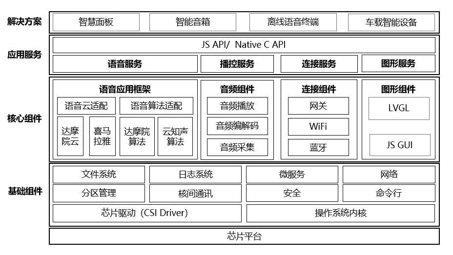

智能语音应用平台（LongYuan）是一个基于 YoC（Yun On Chip，[详情](https://www.xrvm.cn/document?temp=yoc-platform-overview&slug=yocbook)）的轻量级高实时的离在线语音应用平台，通过打造音频播放器、分布式语音AI、JS GUI引擎等轻量化的组件和易用的应用框架，让语音零基础的开发者，能够快速开发出智能语音产品。典型应用场景包括：智能音箱、故事机、语音面板、声控小家电等。
# 平台特性

- 轻量级高实时的YoC系统
   - RTOS操作系统内核，丰富的基础组件
   - 轻量全栈开销，泛音箱产品资源消耗：Flash < 8MB，RAM < 8MB
   - 秒级启动，极速语音唤醒响应（达摩院算法 < 300ms）
- 轻量级音频播控服务
   - 支持播放、暂停、seek、倍速播放功能，支持重采样、均衡器(EQ)、混音等音效处理，支持多音频源优先级仲裁
   - 支持PCM、ADPCM、MP3、AAC、AMR、SPEEX、OPUS、FLAC等主流音频编解码格式
   - CPU占用率低 ，资源占用少（MP3解码: CPU占用 < 40Mhz, Flash < 35KB, RAM < 20KB）
- 端云一体语音应用框架 
   - 基于事件驱动的应用开发框架，简单易用的应用接口
   - 支持语音采集、前处理、识别、上云、结果返回等全链路语音处理能力
   - 支持达摩院、云知声、喜马拉雅等端云一体的语音算法、内容服务和AI技能服务
   - 支持插件化开发扩展，可适配第三方算法和云服务
- 轻量级GUI引擎 
   - 支持轻量级JavaScript框架GUI引擎，支持Vue.js的开源生态，支持类Android图形控件
   - 支持第三方开源嵌入式图形引擎LVGL
- 分布式接入 
   - 支持Wi-Fi、蓝牙、蓝牙mesh等无线接入和组网方式
   - 支持蓝牙mesh model 和云平台物模型的转换以及动态更新
   - 支持分布式设备鉴权、设备管理、OTA升级、规则引擎等网关服务

# 平台架构 

# 平台手册

在线文档：[在线链接](https://www.xrvm.cn/document?temp=introduction-to-longyuan-intelligent-speech-application-platform&slug=longyuan)

离线文档：本地文档手册（智能语音应用平台.lakebook）将以lakebook方式提供，请登录[语雀](https://www.yuque.com/download)下载阅读工具。

# 版本说明

[Release Notes](https://www.xrvm.cn/document?temp=version-description&slug=longyuan)

