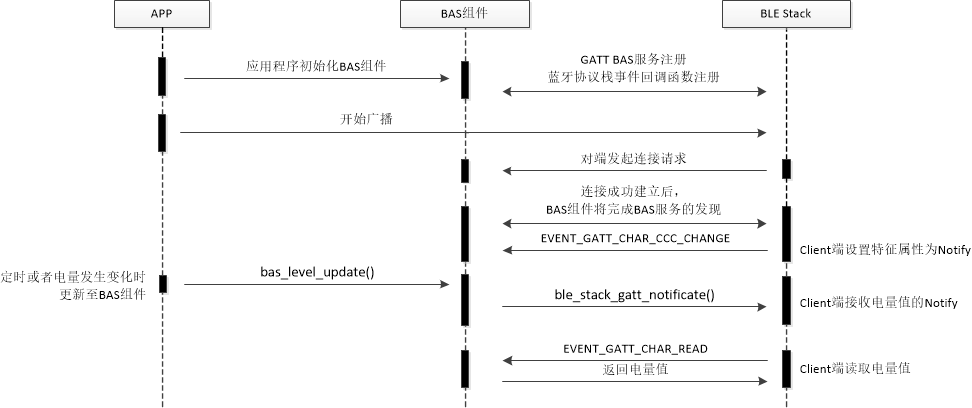
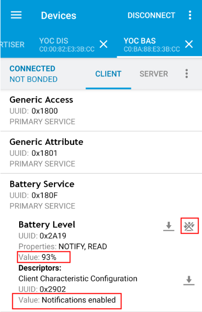

## Title:  BLE BAS应用开发

# 1. 简介

BAS Profile提供了电池电量上报的机制。本文将展示如何使用蓝牙协议栈开发BAS应用的过程。

# 2. 工作流程

蓝牙协议栈中实现了BAS服务，应用程序可以定时通过BAS服务上报电池电量信息至Client端。

示例中处理流程如图所示：



## 2.1. 应用初始化

应用入口函数app_main()，主要实现如下功能：

- 蓝牙协议栈的初始化，配置MAC地址及类型
- 注册蓝牙协议栈事件回调处理函数
- 注册BAS服务
- 开启广播
- 上报电池电量信息

代码分析：

```c
int app_main()
{
	......
    /* 板级初始化，各业务模块初始化 */
    board_yoc_init();

	...
    /* 蓝牙设备地址参数设置 */
    dev_addr_t addr = {DEV_ADDR_LE_RANDOM, DEVICE_ADDR};
    /* 蓝牙协议栈初始化参数设置 */
    init_param_t init = {
        .dev_name = DEVICE_NAME,
        .dev_addr = &addr,
        .conn_num_max = 1,
    };
	...

	/* 蓝牙协议栈初始化 */
    ret = ble_stack_init(&init);
	...
    /* 注册蓝牙协议栈事件回调函数 */
    ret = ble_stack_event_register(&ble_cb);
	...
	/* BAS服务初始化 */
    g_bas_handle = bas_init(&g_bas);
	...

    while (1) {
		/* 未广播状态并且未连接时开启广播 */
        if (!adv_onging && g_conn_handle < 0) {
            start_adv();
        }

       	/* 模拟通过BAS服务更新电量数值至Host */
        bas_level_update(g_bas_handle, batter_level++);
		...

    }

    return 0;   
}
```

- 通过手机的nRF Connect软件可以看到该应用示例的广播数据为

| LEN  | TYPE | VALUE            | 字段说明                   |
| ---- | ---- | ---------------- | -------------------------- |
| 2    | 0x01 | 0x06             | AD_DATA_TYPE_FLAGS         |
| 3    | 0x03 | 0x0F18           | AD_DATA_TYPE_UUID16_ALL    |
| 8    | 0x09 | 0x596F4320424153 | AD_DATA_TYPE_NAME_COMPLETE |

## 2.2. 蓝牙协议栈事件处理

蓝牙协议栈的事件是通过event_callback()回调函数上报，应用程序需要对这些事件进行相应的处理：

- 连接成功或失败事件
- 连接参数更新事件
- 处理对端发起的MTU协商请求

代码分析：

```c
static int event_callback(ble_event_en event, void *event_data)
{
    switch (event) {
        /* 连接成功或失败事件 */
        case EVENT_GAP_CONN_CHANGE:
            conn_change(event, event_data);
            break;
            
        /* 连接参数更新事件 */
        case EVENT_GAP_CONN_PARAM_UPDATE:
            conn_param_update(event, event_data);
            break;
            
        /* MTU协商事件 */
        case EVENT_GATT_MTU_EXCHANGE:
            mtu_exchange(event, event_data);
            break;

        default:
            LOGD(TAG, "Unhandle event %x", event);
            break;
    }
    return 0;
}
```

# 3. 例程运行

BLE BAS示例程序的运行步骤为：

- 连接串口调试工具, 配置为
  波特率: 115200, 数据位: 8, 校验位: None, 停止位: 1, 流控: None
- 复位开发板
- BAS示例将发送广播包，设备名为'YoC BAS'

```c
[   0.046]<I>DEMO Bluetooth BAS demo!
[   0.155]<I>DEMO adv start!
```

- 手机nRF Connect软件可以扫描到设备名称为'YoC HRS'的设备，点击’Connect‘后设备日志

```c
/* 连接成功事件 */
[   4.436]<D>DEMO event 5000001
[   4.450]<I>DEMO Connected

/* 连接参数更新事件 */
[ 781.479]<D>DEMO event 5000004
[ 781.484]<I>DEMO LE conn param updated: int 0x0006 lat 0 to 500

[ 781.831]<D>DEMO event 5000004
[ 781.836]<I>DEMO LE conn param updated: int 0x0028 lat 0 to 500
```

- 手机nRF Connect软件使能Notify属性，可以看到Battrey level属性中的Value值在变化



- 手机nRF Connect软件操作Disconnect

```c
/* 连接断开事件 */
[ 424.122]<I>DEMO Disconnected
/* 重新开始广播 */
[ 424.302]<I>DEMO adv start!
```
