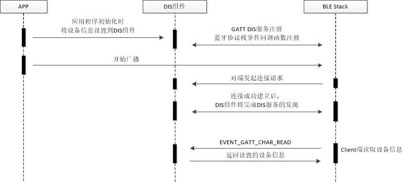

## Title:  BLE DIS应用开发

# 1. 简介

DIS Profile提供了对设备制作商，设备软硬件版本的控制，以及实现生产信息的披露。本文将展示如何使用蓝牙协议栈开发DIS应用的过程。

# 2. 工作流程

蓝牙协议栈中实现了DIS服务，应用程序只需要配置DIS服务中的设备信息参数，Client端即可来读取信息内容。

示例中处理流程如图所示：



## 2.1. 应用初始化

应用入口函数main()，主要实现如下功能：

- 蓝牙协议栈的初始化，配置MAC地址及类型
- 注册蓝牙协议栈事件回调处理函数
- 开启广播

代码分析：

```c
#define MANUFACTURER_NAME "PINGTOUGE"
#define MODEL_NUMBER "MODE_DEMO"
#define SERIAL_NUMBER "00000001"
#define HW_REV "0.0.1"
#define FW_REV "0.0.2"
#define SW_REV "0.0.3"

static dis_info_t dis_info = {
    MANUFACTURER_NAME,
    MODEL_NUMBER,
    SERIAL_NUMBER,
    HW_REV,
    FW_REV,
    SW_REV,
    NULL,
    NULL,
    NULL,
};

int main()
{
	......
    /* 板级初始化，各业务模块初始化 */
    board_yoc_init();
    
    /* 蓝牙设备地址参数设置 */
    dev_addr_t addr = {DEV_ADDR_LE_RANDOM, DEVICE_ADDR};
    
    /* 蓝牙协议栈初始化参数设置 */
    init_param_t init = {
        .dev_name = DEVICE_NAME,
        .dev_addr = &addr,
        .conn_num_max = 1,
    };

    
    ad_data_t ad[2] = {0};

    LOGI(TAG, "Bluetooth DIS demo!");

    /* 蓝牙协议栈初始化 */
    ble_stack_init(&init);

    /* 注册蓝牙协议栈事件回调函数 */
    ble_stack_event_register(&ble_cb);

    /* DIS服务初始化 */
    g_dis_handle = ble_prf_dis_init(&dis_info);
	...
	/* ad_data_t结构体中，len为实际数据长度。
      而BT规范中定义AD Structure数据格式的LEN = （type字段长度 + 实际数据长度），协议栈内部会根据ad_data_t结构体的内容自动填充PDU */
    uint8_t flag = AD_FLAG_GENERAL | AD_FLAG_NO_BREDR;
    ad[0].type = AD_DATA_TYPE_FLAGS;
    ad[0].data = (uint8_t *)&flag;
    ad[0].len = 1;

    /* 设置UUID为0x0A18, BT规范中定义DIS Service UUID为0x0A18 */
    uint8_t uuid16_list[] = {0x0a, 0x18};
    ad[1].type = AD_DATA_TYPE_UUID16_ALL;
    ad[1].data = (uint8_t *)uuid16_list;
    ad[1].len = sizeof(uuid16_list);
    /* 设置参数 */
    adv_param_t param = {
        ADV_IND, //可扫描可连接广播
        ad, //广播数据，可查看BT规范了解AD Structure数据格式定义
        NULL, //scan response数据, DIS示例无scan response数据
        BLE_ARRAY_NUM(ad), //AD Structure个数
        0, //scan response数据个数
        /* adv interval time = interval * 0.625 ms */
        ADV_FAST_INT_MIN_1, //最小广播间隔；adv_interval_min:30.000 ms
        ADV_FAST_INT_MAX_1, //最大广播间隔；adv_interval_max:60.000 ms
    };

    ret = ble_stack_adv_start(&param);
    ...

    return 0;
}
```

- 通过手机的nRF Connect软件可以看到该应用示例的广播数据为

| LEN  | TYPE | VALUE            | 字段说明                   |
| ---- | ---- | ---------------- | -------------------------- |
| 2    | 0x01 | 0x06             | AD_DATA_TYPE_FLAGS         |
| 3    | 0x03 | 0x0A18           | AD_DATA_TYPE_UUID16_ALL    |
| 8    | 0x09 | 0x596F4320444953 | AD_DATA_TYPE_NAME_COMPLETE |

## 2.2. 蓝牙协议栈事件处理

蓝牙协议栈的事件是通过event_callback()回调函数上报，应用程序需要对这些事件进行相应的处理：

- 连接成功或失败事件
- 连接参数更新事件
- 处理对端发起的MTU协商请求

代码分析：

```c
static int event_callback(ble_event_en event, void *event_data)
{
    switch (event) {
        /* 连接成功或失败事件 */
        case EVENT_GAP_CONN_CHANGE:
            conn_change(event, event_data);
            break;
            
        /* 连接参数更新事件 */
        case EVENT_GAP_CONN_PARAM_UPDATE:
            conn_param_update(event, event_data);
            break;
            
        /* MTU协商事件 */
        case EVENT_GATT_MTU_EXCHANGE:
            mtu_exchange(event, event_data);
            break;

        default:
            LOGD(TAG, "Unhandle event %x", event);
            break;
    }
    return 0;
}
```

# 3. 例程运行

BLE DIS示例程序的运行步骤为：

- 连接串口调试工具, 配置为
  波特率: 115200, 数据位: 8, 校验位: None, 停止位: 1, 流控: None
- 复位开发板
- DIS示例将发送广播包，设备名为'YoC DIS'

```c
[   0.046]<I>DEMO Bluetooth DIS demo!
[   0.155]<I>DEMO adv start!
```

- 手机nRF Connect软件可以扫描到设备名称为'YoC HRS'的设备，点击’Connect‘后设备日志

```c
/* 连接成功事件 */
[   4.436]<D>DEMO event 5000001
[   4.450]<I>DEMO Connected

/* 连接参数更新事件 */
[ 781.479]<D>DEMO event 5000004
[ 781.484]<I>DEMO LE conn param updated: int 0x0006 lat 0 to 500

[ 781.831]<D>DEMO event 5000004
[ 781.836]<I>DEMO LE conn param updated: int 0x0028 lat 0 to 500
```

- 手机nRF Connect软件读取Manufacturer Name String属性，手机界面将显示Value为"PINGTOUGE"
- 手机软件读取Model Numer String属性，手机界面将显示Value为"MODE_DEMO"
- 手机软件读取Serial Number String属性，手机界面将显示Value为"00000001"
- 手机软件读取Hardware Revision String属性，手机界面将显示Value为"0.0.1"，与代码中设置一致

- 手机nRF Connect软件操作Disconnect

```c
/* 连接断开事件 */
[ 424.122]<I>DEMO Disconnected
```

- 目前示例中断连后未再次广播数据