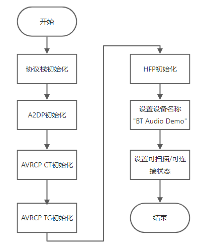

# 概述
蓝牙音频技术是一种常见的无线音频传输手段，在蓝牙耳机，蓝牙音箱等产品中得到了广泛的使用。
通常概念上的蓝牙音频指采用经典蓝牙中A2DP，AVRCP，HFP等Profile实现的技术，本文描述的实例也是以此为基础。
在蓝牙5.2之后版本，SIG组织提出了新一代的低功耗蓝牙音频技术，称为LE Audio，需要注意区分。
# 功能说明
本实例实现了完整的蓝牙音频播放方案：

- 基于A2DP, 实现了蓝牙播歌
- 基于AVRCP, 实现了音频的控制
- 基于HFP, 实现了蓝牙通话
# 环境搭建
本实例程序可以运行在如下硬件平台：

| 平台名称 | 说明文档 |
| --- | --- |
| BL606P 开发板 | [开发板快速上手手册](https://xuantie.t-head.cn/document?temp=quick-start-manual-for-bl606-p-development-board&slug=longyuan) |

# 代码解读
蓝牙音频开发过程主要包括两个部分：

- 蓝牙协议栈和Profiles的初始化
- 蓝牙事件的处理
## 初始化
  
蓝牙初始化部分主要以下几个步骤

1. 初始化蓝牙协议栈
1. 初始化A2DP,AVRCP CT/TG，HFP Profile
1. 设置蓝牙可发现可连接状态
## 事件处理
A2DP，AVRCP，HFP均采用事件异步处理的机制，其中大部分事件用于状态的通知，不需要复杂的业务逻辑。
### A2DP事件处理
表1 A2DP事件类型

| 事件类型 | 类型说明 |
| --- | --- |
| BT_PRF_A2DP_CONNECTION_STATE_EVT | 连接事件 |
| BT_PRF_A2DP_AUDIO_STATE_EVT | 音频流状态改变事件 |
| BT_PRF_A2DP_AUDIO_SBC_CFG_EVT | 音频流参数配置事件 |

#### 事件处理流程
```c
static void a2dp_handle(bt_prf_a2dp_cb_event_t event, bt_prf_a2dp_cb_param_t *param)
{
    uint8_t *bt_addr;
    uint8_t *conf;

    switch (event) {
        case BT_PRF_A2DP_CONNECTION_STATE_EVT:
            if (param->conn_stat.state == BT_PRF_A2DP_CONNECTION_STATE_DISCONNECTED_ABNORMAL) {
                /* A2DP 异常断连处理，发起重连 */
                bt_prf_a2dp_sink_connect(&param->conn_stat.peer_addr);
            } else if (param->conn_stat.state == BT_PRF_A2DP_CONNECTION_STATE_DISCONNECTED_NORMAL) {
                /* A2DP 正常断连，设备配置为可连接状态 */
                bt_stack_set_connectable(1);
            }
            break;
        case BT_PRF_A2DP_AUDIO_STATE_EVT:
            /* 音频流事件， 通常无需处理 */
            break;
        case BT_PRF_A2DP_AUDIO_SBC_CFG_EVT:
            /* 音频SBC配置事件， 通常无需处理 */
            break;
    }
}
```

### AVRCP CT事件处理
表2 AVRCP CT事件类型

| 事件类型 | 类型说明 |
| --- | --- |
| BT_PRF_AVRCP_CT_CONNECTION_STATE_EVT | 连接事件 |
| BT_PRF_AVRCP_CT_PASSTHROUGH_RSP_EVT | 透传按键事件回复 |
| BT_PRF_AVRCP_CT_METADATA_RSP_EVT | 音频流参数配置事件 |
| BT_PRF_AVRCP_CT_PLAY_STATUS_RSP_EVT | 音频播放状态通知 |
| BT_PRF_AVRCP_CT_CHANGE_NOTIFY_EVT | 对端设备状态改变通知 |
| BT_PRF_AVRCP_CT_REMOTE_FEATURES_EVT | 对端设备indication状态通知 |
| BT_PRF_AVRCP_CT_GET_RN_CAPABILITIES_RSP_EVT | 对端设备支持状态能力响应 |
| BT_PRF_AVRCP_CT_SET_ABSOLUTE_VOLUME_RSP_EVT | 设置绝对音量回复 |


#### 事件处理流程

```c
static void avrcp_ct_handle(bt_prf_avrcp_ct_cb_event_t event, bt_prf_avrcp_ct_cb_param_t *param)
{
    uint8_t *bt_addr;
    uint16_t bits;

    switch (event) {
        case BT_PRF_AVRCP_CT_CONNECTION_STATE_EVT:
            /* 获取对端设备通知能力 */
#if !(defined(CONFIG_APP_NO_AVRCP_TG) && CONFIG_APP_NO_AVRCP_TG)
            if (param->conn_stat.connected) {
                bt_prf_avrcp_ct_cmd_get_rn_capabilities();
            }
#endif
            break;
        case BT_PRF_AVRCP_CT_PASSTHROUGH_RSP_EVT:
            break;
        case BT_PRF_AVRCP_CT_METADATA_RSP_EVT:
            break;
        case BT_PRF_AVRCP_CT_PLAY_STATUS_RSP_EVT:
            break;
        case BT_PRF_AVRCP_CT_CHANGE_NOTIFY_EVT:
            /* 再次订阅通知状态 */
            bt_prf_avrcp_ct_cmd_register_notification(param->change_ntf.event_id);
            break;
        case BT_PRF_AVRCP_CT_SET_ABSOLUTE_VOLUME_RSP_EVT:
            break;
        case BT_PRF_AVRCP_CT_REMOTE_FEATURES_EVT:
            break;
        case BT_PRF_AVRCP_CT_GET_RN_CAPABILITIES_RSP_EVT:
            /* 默认订阅播放状态通知 */
            bits = param->get_rn_caps_rsp.evt_set.bits;
            LOGD(TAG, "AVRCP_CT_GET_RN_CAPABILITIES_RSP_EVT evt_bitmap: %08x", bits);
            if (bits & (1 << BT_PRF_AVRCP_NOTIFICATION_PLAY_STATUS_CHANGE)) {
                bt_prf_avrcp_ct_cmd_register_notification(BT_PRF_AVRCP_NOTIFICATION_PLAY_STATUS_CHANGE);
            }
            break;
        default:
            break;
    }
}
```

### AVRCP TG事件处理
表3 AVRCP TG事件类型

| 事件类型 | 类型说明 |
| --- | --- |
| BT_PRF_AVRCP_TG_CONNECTION_STATE_EVT | 连接事件 |
| BT_PRF_AVRCP_TG_REMOTE_FEATURES_EVT | 对端设备indication状态通知 |
| BT_PRF_AVRCP_TG_PASSTHROUGH_CMD_EVT | 透传按键事件 |
| BT_PRF_AVRCP_TG_SET_ABSOLUTE_VOLUME_CMD_EVT | 音量设置事件 |
| BT_PRF_AVRCP_TG_REGISTER_NOTIFICATION_EVT | 注册通知事件 |

#### 事件处理流程

```c
static void avrcp_tg_handle(bt_prf_avrcp_tg_cb_event_t event, bt_prf_avrcp_tg_cb_param_t *param)
{
    uint8_t *bt_addr;

    switch (event) {
        case BT_PRF_AVRCP_TG_CONNECTION_STATE_EVT:
            break;
        case BT_PRF_AVRCP_TG_PASSTHROUGH_CMD_EVT:
            break;
        case BT_PRF_AVRCP_TG_REGISTER_NOTIFICATION_EVT:
            /* 返回当前设备音量 */
            bt_prf_avrcp_rn_param_t p;
            p.volume = 0x7F;
            bt_prf_avrcp_tg_send_rn_rsp(param->reg_ntf.event_id, BT_AVRCP_RESPONSE_INTERIM, &p);
            break;
        case BT_PRF_AVRCP_TG_SET_ABSOLUTE_VOLUME_CMD_EVT:
            break;
        case BT_PRF_AVRCP_TG_REMOTE_FEATURES_EVT:
            break;
        default:
            break;
    }
}
```

### HFP事件处理
表4 HFP事件类型

| 事件类型 | 类型说明 |
| --- | --- |
| BT_PRF_HFP_HF_CONNECTION_STATE_EVT | 服务连接事件 |
| BT_PRF_HFP_HF_AUDIO_STATE_EVT | 音频连接事件 |
| BT_PRF_HFP_HF_BVRA_EVT | 语音识别状态变化事件 |
| BT_PRF_HFP_HF_CIND_CALL_EVT | 电话状态通知 |
| BT_PRF_HFP_HF_CIND_CALL_SETUP_EVT | 电话拨打状态通知 |
| BT_PRF_HFP_HF_CIND_CALL_HELD_EVT | 电话挂起状态通知 |
| BT_PRF_HFP_HF_CIND_SERVICE_AVAILABILITY_EVT | 网络状态是否可用通知 |
| BT_PRF_HFP_HF_CIND_SIGNAL_STRENGTH_EVT | AG设备信号强度 |
| BT_PRF_HFP_HF_CIND_ROAMING_STATUS_EVT | AG设备漫游状态 |
| BT_PRF_HFP_HF_CIND_BATTERY_LEVEL_EVT | AG设备电池状态 |
| BT_PRF_HFP_HF_COPS_CURRENT_OPERATOR_EVT | 当前操作信息 |
| BT_PRF_HFP_HF_BTRH_EVT | 电话回应状态通知 |
| BT_PRF_HFP_HF_CLIP_EVT | 呼叫路线识别通知 |
| BT_PRF_HFP_HF_CCWA_EVT | 呼叫等待状态通知 |
| BT_PRF_HFP_HF_CLCC_EVT | 当前呼叫通知列表 |
| BT_PRF_HFP_HF_VOLUME_CONTROL_EVT | 音量控制 |
| BT_PRF_HFP_HF_AT_RESPONSE_EVT | AT命令回复通知 |
| BT_PRF_HFP_HF_CNUM_EVT | AG对订阅的响应 |
| BT_PRF_HFP_HF_BSIR_EVT | 设置带内铃声 |
| BT_PRF_HFP_HF_BINP_EVT | 请求来自AG的上一个语音标签号 |
| BT_PRF_HFP_HF_RING_IND_EVT | 铃声通知 |

#### 事件处理流程

```c
static void hfp_handle(bt_prf_hfp_hf_cb_event_t event, bt_prf_hfp_hf_cb_param_t *param)
{
    uint8_t *bt_addr;

    switch (event) {
        case BT_PRF_HFP_HF_CONNECTION_STATE_EVT:
            /* HFP 连接状态 */
            break;
        case BT_PRF_HFP_HF_AUDIO_STATE_EVT:
            /* HFP 音频状态 */
            break;
        case BT_PRF_HFP_HF_CIND_CALL_EVT:
            LOGD(TAG, "HF_CIND_CALL_EVT %d", param->call.status);
            break;
        case BT_PRF_HFP_HF_CIND_CALL_SETUP_EVT:
            LOGD(TAG, "HF_CIND_CALL_SETUP_EVT %d", param->call_setup.status);
            break;
        case BT_PRF_HFP_HF_CIND_CALL_HELD_EVT:
            LOGD(TAG, "HF_CIND_CALL_HELD_EVT %d", param->call_held.status);
            break;
        case BT_PRF_HFP_HF_CIND_SERVICE_AVAILABILITY_EVT:
            LOGD(TAG, "HF_CIND_SERVICE_AVAILABILITY_EVT %d", param->service_availability.status);
            break;
        case BT_PRF_HFP_HF_CLIP_EVT:
            LOGD(TAG, "HF_CLIP_EVT %s", param->clip.number);
            break;
        case BT_PRF_HFP_HF_CCWA_EVT:
            LOGD(TAG, "HF_CCWA_EVT %s", param->ccwa.number);
            break;
        case BT_PRF_HFP_HF_CLCC_EVT:
            LOGD(TAG, "HF_CLCC_EVT %s", param->clcc.number);
            break;
        case BT_PRF_HFP_HF_BSIR_EVT:
            LOGD(TAG, "HF_BSIR_EVT %d", param->bsir.state);
            break;
        case BT_PRF_HFP_HF_CIND_BATTERY_LEVEL_EVT:
            LOGD(TAG, "HF_CIND_BATTERY_LEVEL_EVT %d", param->battery_level.value);
            break;
        case BT_PRF_HFP_HF_CIND_ROAMING_STATUS_EVT:
            LOGD(TAG, "HF_CIND_ROAMING_STATUS_EVT %d", param->roaming.status);
            break;
        case BT_PRF_HFP_HF_CIND_SIGNAL_STRENGTH_EVT:
            LOGD(TAG, "HF_CIND_SIGNAL_STRENGTH_EVT %d", param->signal_strength.value);
            break;
        case BT_PRF_HFP_HF_RING_IND_EVT:
            LOGD(TAG, "HF_RING_IND_EVT");
        case BT_PRF_HFP_HF_VOLUME_CONTROL_EVT:
        case BT_PRF_HFP_HF_AT_RESPONSE_EVT:
        case BT_PRF_HFP_HF_CNUM_EVT:
        case BT_PRF_HFP_HF_BINP_EVT:
        case BT_PRF_HFP_HF_COPS_CURRENT_OPERATOR_EVT:
        case BT_PRF_HFP_HF_BTRH_EVT:
        case BT_PRF_HFP_HF_BVRA_EVT:
            break;
    }
}
```

# 例程运行
1. 编译烧录`bt_audio_demo`
2. 开发板上电，连接串口
3. 打开手机，使用系统蓝牙连接"BT Audio Demo"设备
4. 打开手机上音乐APP，播放音乐, 日志串口出现如下打印，A2DP_AUDIO_STATE_EVT 2 表示音频流开始传输。设备外接喇叭音乐播放。

```bash
[ 158.086]<D>[APP]<bt_co_thread>A2DP_AUDIO_STATE_EVT 2, mac c0:a6:00:7c:82:e2
```

5. 在串口日志界面输入如下命令，实现音乐的播放和暂停

```bash
#音乐播放
bt avrcp pt 68 0
bt avrcp pt 68 1

#音乐暂停
bt avrcp pt 69 0
bt avrcp pt 69 1
```
# 组件API 介绍
ble_host
# 参考
表5 AVRCP支持按键键值

| 按键名称 | 键值 | 说明 |
| --- | --- | --- |
| BT_PRF_AVRCP_OP_ID_SELECT | 0x00 | select |
| BT_PRF_AVRCP_OP_ID_UP | 0x01 | up |
| BT_PRF_AVRCP_OP_ID_DOWN | 0x02 | down |
| BT_PRF_AVRCP_OP_ID_LEFT | 0x03 | left |
| BT_PRF_AVRCP_OP_ID_RIGHT | 0x04 | right |
| BT_PRF_AVRCP_OP_ID_RIGHT_UP | 0x05 | right-up |
| BT_PRF_AVRCP_OP_ID_RIGHT_DOWN | 0x06 | right-down |
| BT_PRF_AVRCP_OP_ID_LEFT_UP | 0x07 | left-up |
| BT_PRF_AVRCP_OP_ID_LEFT_DOWN | 0x08 | left-down |
| BT_PRF_AVRCP_OP_ID_ROOT_MENU | 0x09 | root menu |
| BT_PRF_AVRCP_OP_ID_SETUP_MENU | 0x0A | setup menu |
| BT_PRF_AVRCP_OP_ID_CONT_MENU | 0x0B | contents menu |
| BT_PRF_AVRCP_OP_ID_FAV_MENU | 0x0C | favorite menu |
| BT_PRF_AVRCP_OP_ID_EXIT | 0x0D | exit |
| BT_PRF_AVRCP_OP_ID_0 | 0x20 | 0 |
| BT_PRF_AVRCP_OP_ID_1 | 0x21 | 1 |
| BT_PRF_AVRCP_OP_ID_2 | 0x22 | 2 |
| BT_PRF_AVRCP_OP_ID_3 | 0x23 | 3 |
| BT_PRF_AVRCP_OP_ID_4 | 0x24 | 4 |
| BT_PRF_AVRCP_OP_ID_5 | 0x25 | 5 |
| BT_PRF_AVRCP_OP_ID_6 | 0x26 | 6 |
| BT_PRF_AVRCP_OP_ID_7 | 0x27 | 7 |
| BT_PRF_AVRCP_OP_ID_8 | 0x28 | 8 |
| BT_PRF_AVRCP_OP_ID_9 | 0x29 | 9 |
| BT_PRF_AVRCP_OP_ID_DOT | 0x2A | dot |
| BT_PRF_AVRCP_OP_ID_ENTER | 0x2B | enter |
| BT_PRF_AVRCP_OP_ID_CLEAR | 0x2C | clear |
| BT_PRF_AVRCP_OP_ID_CHAN_UP | 0x30 | channel up |
| BT_PRF_AVRCP_OP_ID_CHAN_DOWN | 0x31 | channel down |
| BT_PRF_AVRCP_OP_ID_PREV_CHAN | 0x32 | previous channel |
| BT_PRF_AVRCP_OP_ID_SOUND_SEL | 0x33 | sound select |
| BT_PRF_AVRCP_OP_ID_INPUT_SEL | 0x34 | input select |
| BT_PRF_AVRCP_OP_ID_DISP_INFO | 0x35 | display information |
| BT_PRF_AVRCP_OP_ID_HELP | 0x36 | help |
| BT_PRF_AVRCP_OP_ID_PAGE_UP | 0x37 | page up |
| BT_PRF_AVRCP_OP_ID_PAGE_DOWN | 0x38 | page down |
| BT_PRF_AVRCP_OP_ID_POWER | 0x40 | power |
| BT_PRF_AVRCP_OP_ID_VOL_UP | 0x41 | volume up |
| BT_PRF_AVRCP_OP_ID_VOL_DOWN | 0x42 | volume down |
| BT_PRF_AVRCP_OP_ID_MUTE | 0x43 | mute |
| BT_PRF_AVRCP_OP_ID_PLAY | 0x44 | play |
| BT_PRF_AVRCP_OP_ID_STOP | 0x45 | stop |
| BT_PRF_AVRCP_OP_ID_PAUSE | 0x46 | pause |
| BT_PRF_AVRCP_OP_ID_RECORD | 0x47 | record |
| BT_PRF_AVRCP_OP_ID_REWIND | 0x48 | rewind |
| BT_PRF_AVRCP_OP_ID_FAST_FORWARD | 0x49 | fast forward |
| BT_PRF_AVRCP_OP_ID_EJECT | 0x4A | eject |
| BT_PRF_AVRCP_OP_ID_FORWARD | 0x4B | forward |
| BT_PRF_AVRCP_OP_ID_BACKWARD | 0x4C | backward |
| BT_PRF_AVRCP_OP_ID_ANGLE | 0x50 | angle |
| BT_PRF_AVRCP_OP_ID_SUBPICT | 0x51 | subpicture |
| BT_PRF_AVRCP_OP_ID_F1 | 0x71 | F1 |
| BT_PRF_AVRCP_OP_ID_F2 | 0x72 | F2 |
| BT_PRF_AVRCP_OP_ID_F3 | 0x73 | F3 |
| BT_PRF_AVRCP_OP_ID_F4 | 0x74 | F4 |
| BT_PRF_AVRCP_OP_ID_F5 | 0x75 | F5 |
| BT_PRF_AVRCP_OP_ID_VENDOR | 0x7E | vendor unique |

