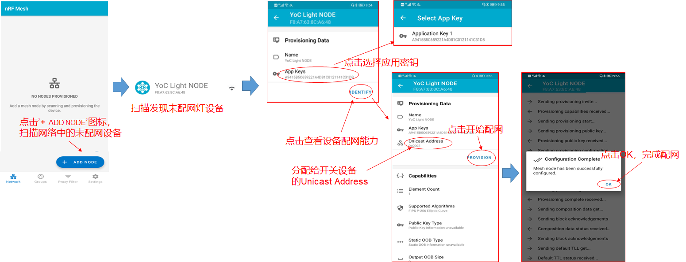
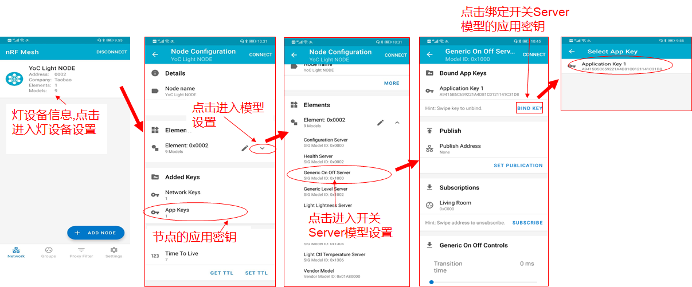
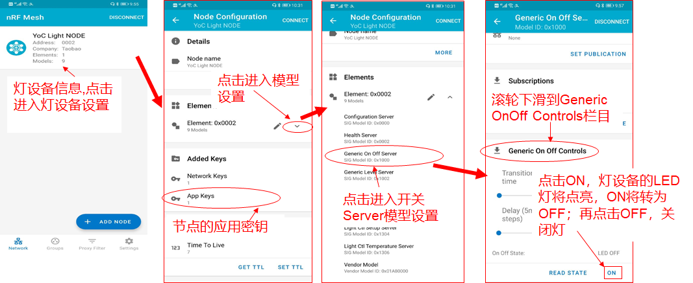

# 1. 智能灯介绍

蓝牙MESH智能灯，是智能家居系统中最基础的设施。通过设置智能灯的模型属性，能够实现轻松、高效地控制灯的状态。本文将使用BLE MESH SDK和蓝牙开发板，以智能灯的开关应用开发为例指导读者进行MESH开发。

# 2. 应用开发

## 2.1. 应用初始化

应用入口函数app_main()，主要实现如下功能：

- 板级初始化
- MESH灯Model定义
- Mesh节点初始化，注册Model事件回调处理函数

代码分析：

```
/* 定义设备名称，使用手机APP扫描时可以看到该名称 */
#define DEVICE_NAME "YoC Light"

/* 定义设备UUID */
#define LIGHT_DEV_UUID {0xcf, 0xa0, 0xe3, 0x7e, 0x17, 0xd9, 0x11, 0xe8, 0x86, 0xd1, 0x5f, 0x1c, 0xe2, 0x8a, 0xde, 0x02}

node_config_t g_node_param = {
    /* 设置节点的UUID */
    .dev_uuid = LIGHT_DEV_UUID,
    /* 设置节点的Device Name */
    .dev_name = DEVICE_NAME,
    /* 注册Model的事件处理回调函数 */
    .user_model_cb = app_event_cb,
    /* 注册Provision的事件处理回调函数 */
    .user_prov_cb = NULL,
    /* RSSI上报功能使能标识，默认关闭 */
    .rssi_report_enable = 0,
};

int app_main(int argc, char *argv[])
{   
    /* 板级初始化，各业务模块初始化 */
    board_yoc_init(); 
    ......
        
    /* MESH灯Model定义,根据灯实际功能定义，如开关、亮度、色温控制等 */
    ret = app_mesh_composition_init();
    ......

    /* MESH节点初始化，设置节点UUID、Device Name并注册Model事件回调函数 */
    ret = ble_mesh_node_init(&g_node_param);
    ......

    /* 信号量初始化 */
    aos_sem_new(&sync_sem, 0);

    while (1) {
        /* 等待信号量 */
        aos_sem_wait(&sync_sem, AOS_WAIT_FOREVER);
    }

    return 0;
}
```

## 2.2. 设备模型定义

MESH解决方案中，模型用于定义设备节点的功能。以MESH灯为例，可以定义下列模型：

- Configuration Server Model

  这个模型用于存储节点的MESH网络配置。

- Health Server Model

  该模型主要用于MESH网络诊断。

- Generic OnOff Server Model

  该模型用于获取、控制设备的开关属性。

- Generic Level Server Model

  该模型用于获取、控制设备的档位属性。

- Generic Lightness Server Model

  该模型用于获取、控制设备的亮度属性。

- Generic CTL Server Model / Generic CTL Setup Server Model / Generic CTL Temperature Server Model

  这三个模型均用于调节设备的色温属性。

代码分析：

```
static struct bt_mesh_model elem0_root_models[] = {
    /* 本设备节点的Configuration Server模型定义 */
    BT_MESH_MODEL_CFG_SRV_NULL(),
    /* 本设备节点的Health Server模型定义 */
    BT_MESH_MODEL_HEALTH_SRV_NULL(),
    /* 本设备节点的Generic OnOff Server模型定义 */
    BT_MESH_MODEL_GEN_ONOFF_SRV_NULL(),
    /* 本设备节点的Generic Level Server模型定义 */
    BT_MESH_MODEL_GEN_LEVEL_SRV_NULL(),
    /* 本设备节点的Generic Lightness Server模型定义 */
    BT_MESH_MODEL_LIGHTNESS_SRV_NULL(),
    /* 本设备节点的Generic CTL Server模型定义 */
    BT_MESH_MODEL_CTL_SRV_NULL(),
    /* 本设备节点的Generic CTL Setup Server模型定义 */
    BT_MESH_MODEL_CTL_SETUP_SRV_NULL(),
    /* 本设备节点的Generic CTL Temperature Server模型定义 */
    BT_MESH_MODEL_CTL_TEMP_SRV_NULL(),
};

/* 本设备节点的Vendor Models模型定义 */
static struct bt_mesh_model elem0_vnd_models[] = {
    BT_MESH_MODEL_VENDOR_SRV_NULL,
};

/* 本设备节点的Elements定义 */
static struct bt_mesh_elem elements[] = {
    BT_MESH_ELEM(0, elem0_root_models, elem0_vnd_models, 0),
};

/* 本设备节点的Composition Datas定义，定义CompanyID、Elements */
static const struct bt_mesh_comp mesh_comp = {
    /* 设置设备节点的CompanyID */
    .cid = 0x01A8,
     /* 设置设备节点的Elements */
    .elem = elements,
    /* 设置设备节点Elements的个数 */
    .elem_count = ARRAY_SIZE(elements),
};

int app_mesh_composition_init()
{
    int ret;
    /* Models初始化 */
    ret = ble_mesh_model_init(&mesh_comp);
    return ret;
}
```

## 2.3. MESH Models事件回调处理

MESH Node组件将根据所定义的Models，上报相关事件及数据。以OnOff属性为例，进行代码解析：

```
void app_event_cb(uint16_t event, void *p_arg)
{
    switch (event) {
        /* 控制OnOff属性 */
        case BT_MESH_MODEL_ONOFF_SET: {
            if (p_arg) {
                model_message message = *(model_message *)p_arg;
                S_ELEM_STATE *elem_state = (S_ELEM_STATE *)message.user_data;
                /* 根据数据包中OnOff值，控制OnOff属性 */
                if (elem_state->state.onoff[T_TAR]) {
                    /* 控制LED灯亮 */
                    led_set_status(led2, true);
                } else {
                    /* 控制LED灯灭 */
                    led_set_status(led2, false);
                }
                ......
            }
        }
        break;
        ......

        /* 通过Vendor Model，发送私有数据 */
        case BT_MESH_MODEL_VENDOR_MESSAGES: {
            if (p_arg) {
                model_message message = *(model_message *)p_arg;
                char data_out[80] = {0};
                ......
            }
        }
        break;

        default:
            break;
    }
}
```

------

***注意：\***

***网络中需要存在多个节点时，需要更改代码中设备UUID后编译烧录该镜像，并烧录镜像时设置不同的MAC地址，避免组网出现问题 。\***

# 3. 例程运行

## 3.1. 编译&烧录

现对Solution package.yaml里部分配置选项进行说明：

-   CONFIG_BT_MESH_GATT_PROXY: 1 - PROXY功能 
-  CONFIG_BT_MESH_PB_GATT: 1 - GATT功能，PROYX和GATT有依赖关系，需同时打开/关闭，打开后功耗将上升，若需支持Gatt配网或者OTA需打开
-   MESH_DEBUG_TX: 1 - MESH 发包打印
-   MESH_DEBUG_RX: 1-  MESH 收包打印
-  CONFIG_OTA_CLIENT: 1- OTA功能
- CONFIG_OCC_AUTH: 1 - MESH OCC鉴权入网，需要烧录KP文件后同网关配合使用

参考《[PHY6220快速上手手册](../../bluetooth/board/quick_start_of_PHY6220.html)》编译和烧录 mesh_light_node_demo 示例

## 3.2. 运行

- 连接串口调试工具, 配置为 波特率: 115200, 数据位: 8, 校验位: None, 停止位: 1, 流控: None
- 开发板拨码开关拨至GND
- 按RESET按键，复位开发板
- 设备将开启Unprovisoin Device Beacon广播，串口上输出'Mesh light node demo'信息

```
[     0.004000][I][init    ]Build:Apr  8 2020,13:34:01
[     0.017000][I][init    ]find 9 partitions
//硬复位计数，首次上电没有存储信息，3秒内再次复位开发板计数将加1，重复5次即可清除入网信息
[     0.175000][E][MESH_RESET]read size error
[     0.184000][I][MESH_RESET]reset_by_repeat_init, number = 1
Welcome to CLI...
> [     0.206000][I][DEMO    ]Mesh light node demo
```

- MESH灯设备配网可参照下图，通过手机nRF Mesh APP操作，绑定应用密钥的索引为1



- 设置智能灯设备中的Generic OnOff Server Model的应用密钥，绑定应用密钥的索引为1



- 手机操作设备成功入网后，在串口输出如下信息

```
/* 手机APP扫描到灯节点后，操作 IDENTITY -> PROVISION */
[    32.264000][I][BT_MESH_NODE]Provisioning link opened on PB-GATT

[    62.701000][I][BT_MESH_NODE]Provisioning link closed on PB-GATT

[    62.731000][I][BT_MESH_NODE]provisioning complete netid 0, primary element address 0x2
/* 入网成功，节点unicast address为0x0002 */
[    62.747000][I][DEMO    ]prov complete 0002
```

- 通过手机nRF Mesh APP绑定Generic OnOff Server Model的APP Key后，控制灯的开关状态



- 开发板在串口上输出如下信息

```
[   146.549000][I][DEMO    ]src:0x0001,led:ON
[   213.850000][I][DEMO    ]src:0x0001,led:OFF
[   225.002000][I][DEMO    ]src:0x0001,led:ON
[   287.153000][I][DEMO    ]src:0x0001,led:OFF
```

 