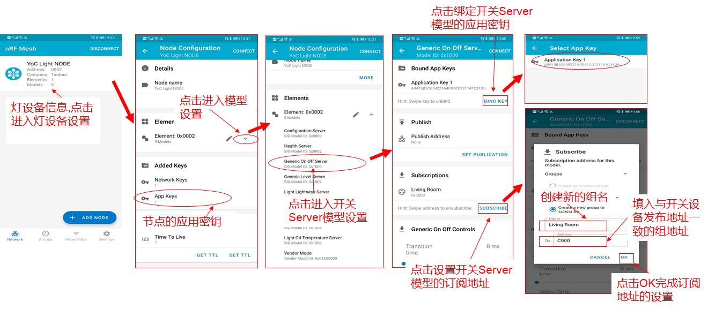
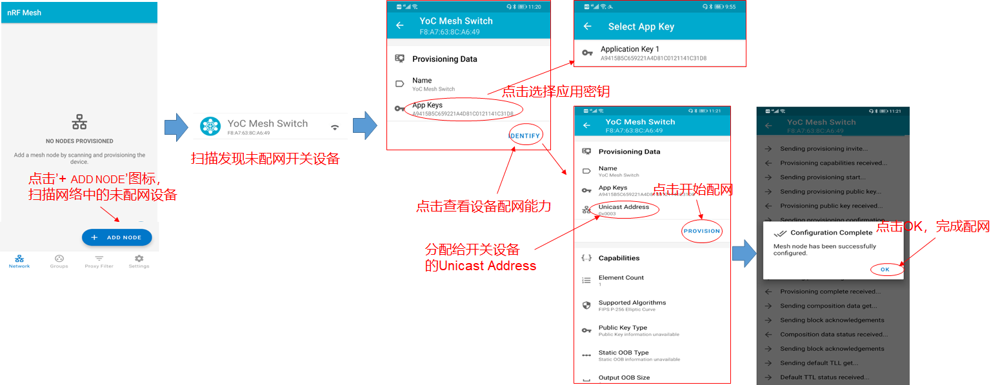
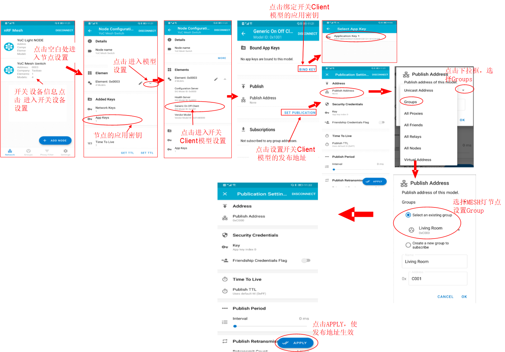

## 蓝牙Mesh智能开关应用开发指南

# 1. 智能开关介绍

本文将使用BLE MESH SDK和蓝牙开发板，通过Shell命令和按键触发模拟智能开关，用来控制智能灯的开关状态。

# 2. 应用开发

## 2.1. 应用初始化

应用入口函数app_main()，主要实现如下功能：

- 板级初始化
- MESH开关Models定义
- Mesh节点初始化，注册Model事件回调处理函数

代码分析：

```
/* 定义设备名称，使用手机APP扫描时可以看到该名称 */
#define DEVICE_NAME "YoC Mesh Switch"

/* 定义设备UUID */
#define SWITCH_DEV_UUID {0xcf, 0xa0, 0xea, 0x72, 0x17, 0xd9, 0x11, 0xe8, 0x86, 0xd1, 0x5f, 0x1c, 0xe2, 0x8a, 0xdf, 0x00}

int app_main(int argc, char *argv[])
{   
    /* 板级初始化，各业务模块初始化 */
    board_yoc_init(); 
    ......
        
    /* MESH开关的Models定义和Node配置参数定义 */
    ret = mesh_dev_init();
    ......

    /* Mesh开关CLI命令初始化 */
    cli_reg_.html_switch_ctrl();
    ......

    /* 初始化开发板板载按键 */
    buttons_init();

    /* 信号量初始化 */
    aos_sem_new(&sync_sem, 0);

    while (1) {
        /* 等待按键触发 */
        aos_sem_wait(&switch_state.sync_sem, AOS_WAIT_FOREVER);

        if (switch_state.button1_press) {
            /* 按键P14触发 */
            switch_state.button1_press = 0;
            /* 向配置好的组播地址发送无需ACK的开或者关指令 */
            gen_onoff_set(switch_state.on_off, false);
            ......

            /* 记录开关状态 */
            prepare_onoff_state(!switch_state.on_off);
        }

        if (switch_state.button2_press) {
            /* 按键P15触发 */
            switch_state.button2_press = 0;
            /* 向配置好的组播地址发送需ACK的开或者关指令，等待ACK事件上报后，更新开关状态 */
            gen_onoff_set(switch_state.on_off, true);
            ......
        }
    }
    return 0;
}
```

## 2.2. 设备模型定义

MESH解决方案中，模型用于定义设备节点的功能。MESH开关可以定义为下列模型：

- Configuration Server Model

  这个模型用于存储节点的MESH网络配置。

- Health Server Model

  该模型主要用于MESH网络诊断。

- Generic OnOff Cient Model

  该模型用于获取、控制Generic OnOff Server设备的开关属性。

代码分析：

```
/* 定义记录开关状态的全局变量 */
static set_onoff_arg set_onoff_data;
static struct bt_mesh_model elem0_root_models[] = {
    /* 本设备节点的Configuration Server模型定义 */
    BT_MESH_MODEL_CFG_SRV_NULL(),
    /* 本设备节点的Health Server模型定义 */
    BT_MESH_MODEL_HEALTH_SRV_NULL(),
    /* 本设备节点的Generic OnOff Client模型定义，发布状态时，将记录的state发布出去 */
    MESH_MODEL_GEN_ONOFF_CLI(&set_onoff_data),
};

/* 本设备节点的Vendor Models模型定义 */
static struct bt_mesh_model elem0_vnd_models[] = {
    BT_MESH_MODEL_VENDOR_SRV_NULL,
};

/* 本设备节点的Elements定义 */
static struct bt_mesh_elem elements[] = {
    BT_MESH_ELEM(0, elem0_root_models, elem0_vnd_models, 0),
};

/* Define device composition data */
static const struct bt_mesh_comp mesh_comp = {
    .cid = CONFIG_CID_TAOBAO,
    .elem = elements,
    .elem_count = ARRAY_SIZE(elements),
};

/* 本设备节点的Composition Datas定义，定义CompanyID、Elements */
static const struct bt_mesh_comp mesh_comp = {
    /* 设置设备节点的CompanyID */
    .cid = CONFIG_CID_TAOBAO,
     /* 设置设备节点的Elements */
    .elem = elements,
    /* 设置设备节点Elements的个数 */
    .elem_count = ARRAY_SIZE(elements),
};

/* 节点参数定义 */
static node_config_t g_node_param = {
    /* 设备UUID */
    .dev_uuid = SWITCH_DEV_UUID,
    /* 设备名称 */
    .dev_name = DEVICE_NAME,
    /* Models事件回调函数注册 */
    .user_model_cb = app_models_event_cb,
    /* Provision事件回调函数注册，为NULL时，Mesh Node组件将处理Provision事件 */
    .user_prov_cb = app_prov_event_cb,
    /* Health Model事件回调函数注册 */
    .health_cb = &g_app_health_cb,
};

int mesh_dev_init(void)
{
    int ret;
    memset(&set_onoff_data, 0, sizeof(set_onoff_arg));

    /* Models定义*/
    ret = ble_mesh_model_init(&mesh_comp);
    ......

    /* 节点参数设置 */
    ret = ble_mesh_node_init(&g_node_param);
    ......
    return 0;
}
```

## 2.3. MESH Models事件回调处理

MESH Node组件将根据所定义的Models，上报相关事件及数据。以OnOff属性为例，进行代码解析：

```
void app_models_event_cb(uint16_t event, void *p_arg)
{
    switch (event) {
        /* Generic OnOff Server上报OnOff状态 */
        case BT_MESH_MODEL_ONOFF_STATUS: {
            if (p_arg) {
                model_message onoff_message = *(model_message *)p_arg;
                uint8_t onoff = onoff_message.status_data->data[0];
                ......
                /* 更新开关状态 */
                prepare_onoff_state(!onoff);
            }
        }
        break;
        ......
    }
}
```

------

***注意：\***

***网络中需要存在多个节点时，需要更改代码中设备UUID后编译烧录该镜像，并烧录镜像时设置不同的MAC地址，避免组网出现问题 。\***

# 3. 例程运行

## 3.1. 示例介绍

本示例的运行需要两块开发板，一块用于烧录MESH开关示例，一块用于烧录MESH灯示例。两个设备可同时通过手机nRF Mesh APP配置入网、绑定APP Key、设置组地址。然后通过MESH开关设备的Shell命令或者按键触发，控制MESH灯的开关状态。

## 3.2. 编译&烧录

现对Solution package.yaml里部分配置选项进行说明：

-   CONFIG_BT_MESH_GATT_PROXY: 1 - PROXY功能 
-   CONFIG_BT_MESH_PB_GATT: 1 - GATT功能，PROYX和GATT有依赖关系，需同时打开/关闭，打开后功耗将上升，若需支持Gatt配网或者OTA需打开
-   MESH_DEBUG_TX: 1 - MESH 发包打印
-   MESH_DEBUG_RX: 1-  MESH 收包打印
-   CONFIG_OTA_CLIENT: 1- OTA功能
-   CONFIG_OCC_AUTH: 1 - MESH OCC鉴权入网，需要烧录KP文件后同网关配合使用

参考《[PHY6220快速上手手册](../../bluetooth/board/quick_start_of_PHY6220.html)》编译和烧录 mesh_switch_node_demo 示例

## 3.3. 运行

- 连接串口调试工具, 配置为 波特率: 115200, 数据位: 8, 校验位: None, 停止位: 1, 流控: None
- 按RESET按键，复位开发板
- 设备将开启Unprovisoin Device Beacon广播，串口上输出'Mesh Switch node demo'信息

```
[   0.006]<I>INIT find 8 partitions
[   0.070]<E>MESH_RESET read size error
/*硬复位计数，首次上电没有存储信息，3秒内再次复位开发板计数将加1，重复5次即可清除入网信息*/
[   0.075]<I>MESH_RESET reset_by_repeat_init, number = 1
[   0.104]<I>INIT Build:Jul 11 2021,18:23:31
[   0.233]<I>DEMO Mesh Switch node demo
```

- MESH灯设备入网操作请参照[智能灯应用开发实例](../../bluetooth/mesh/BLE_SIG_MESH_Light_Node_Development.html) 操作，发布地址的操作如下图所示：

  **注意：MESH灯设备的Generic OnOff Server Model应用密钥需要设置与MESH开关设备一致，SUB地址与MESH开关的PUB地址一致**

  

- MESH开关设备配网可参照下图，通过手机nRF Mesh APP操作，绑定应用密钥的索引为1



- 手机操作设备入网时，将在串口输出如下信息

```
/* 手机APP扫描到灯节点后，操作 IDENTITY -> PROVISION */
> [    75.233000][I][BT_MESH_NODE]Provisioning link opened on PB-GATT

[    90.943000][I][BT_MESH_NODE]Provisioning link closed on PB-GATT

[    90.973000][I][BT_MESH_NODE]provisioning complete netid 0, primary element address 0x3
/* 入网成功，节点unicast address为0x0003 */
[    90.990000][I][Mesh CTRL]prov complete 0003
```

- 设置MESH开关设备中的Generic OnOff Client Model的应用密钥，绑定应用密钥的索引为1；并设置Publication地址为0xC000。



- 通过Shell命令控制智能灯的开关状态，设备将在串口上输出如下信息

```
//控制网络中0xC000组中的Mesh灯开，因此会收到Models BT_MESH_MODEL_ONOFF_STATUS事件
> meshonoff 1 1

//控制网络中0xC000组中的Mesh灯关，无Models事件上报
> meshonoff 0 0
```

## 3.5. Shell命令

```
// 开关控制命令
$ meshonoff <onoff 0,1> <ack 0,1>
onoff: 开关状态   1 - 开； 0 - 关；
ack: 设置该请求是否需要ACK回应   1 - 需要ACK，ACK将通过Models事件上报； 0 - 无需ACK

// 节点网络配置复位
$ meshrst
```

 