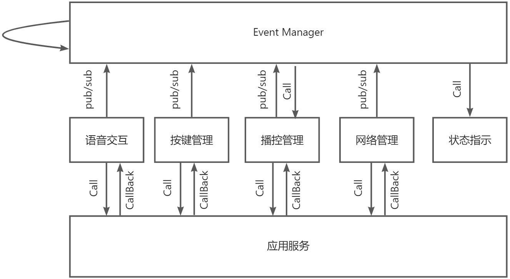
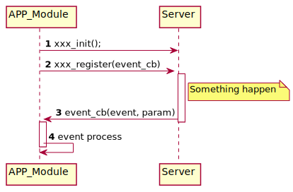

# 概述
本方案以智能语音芯片作为核心硬件载体，集成了WiFi/蓝牙等无线接入能力，和麦克风、PA、按键、屏显等输入输出设备，重点解决了语音采集、前处理、识别、上云、结果返回等全链路语音交互问题，是面向智能语音终端产品的整体解决方案。适用于智能语音故事机、智能音箱等应用场景。

# 方案系统框图

​         

智能语音终端解决方案由输入输出，语音终端，语音云三大部分组成。

- 输入输出：输入设备包括双路模拟麦克风，输出设备包括喇叭，GPIO/ADC按键，状态指示灯
- 智能语音终端：支持包括语音唤醒，关键字识别，音频播控，云端接入等核心能力
- 语音云：三方语音云，支持ASR/NLP/TTS服务

# 方案说明

## 输入输出

方案主要通过麦克风采集语音和喇叭播放音频与用户进行语音交互，同时使用按键和状态指示灯作为辅助交互方式。

- 麦克风采集语音：采用 2 路模拟麦克风采集语音，麦克风路数往往取决于语音算法处理能力
- 喇叭播放音频：输出音频信号经过模拟放大器后通过喇叭播放；放大后的模拟信号同时会通过衰减电路再次输入给设备，作为回声信号用于回声消除处理
- 按键：支持 GPIO/ADC 按键，可根据开发需要自定义功能
- 状态指示灯：通过 GPIO 引脚外接 LED 状态指示灯，控制 LED 亮灭指示不同状态

## 语音终端

应用方案采用模块化设计，主要分为6个模块

- 事件管理
- 语音交互
- 播控管理
- 网络管理
- 按键管理
- 状态指示

### 应用方案设计思想

应用模块之间相对独立，其中事件管理模块居中调度，实现模块之间的交互逻辑。

事件管理模块，采用了Pub/Sub的设计，6个模块之间的关系如下：

- 事件管理模块订阅了所有需要处理的事件。在相关的事件处理过程中，会调用状态指示模块的功能实现状态指示。事件模块本身也会发布事件，发布对象为自身，通常是某一事件触发另一事件的情况。
- 语音交互，按键管理，播控管理，网络管理会通过接口调用+Callback的方式调用语音应用平台提供应用服务，同时会向事件管理模块发布事件
- 状态指示模块，不对外发布事件，仅被调用。

应用模块同应用服务之间的交互，采用接口调用+Callback方式使用龙渊语音智能平台提供的核心应用服务， 通常设计模式如下

- 模块直接调用应用服务提供的接口直接使用相关功能
- 应用服务通过事件通知模块相应状态变化

如上图所示，应用模块初始化平台提供的服务，注册服务回调函数，然后处理回调函数返回的事件。

在整个终端方案中，各个模块相对独立，各自基于龙渊语音应用平台提供的应用服务实现相应功能，同时所有事件被统一到事件管理模块处理，方便应用开发者实现方案整体的业务逻辑。

## 语音云

语音云负责接收终端设备上传的语音数据，在云端进行ASR、NLP、TTS 等语音处理，并将处理后的结果下发到设备。方案目前使用达摩院语音云，并可支持喜马拉雅、云知声等其他语音云。为了方便不同语音云厂商开发和适配，龙渊语音应用平台定义了一套统一的语音云适配接口。方案只需要和统一接口进行交互，无需关心不同云的具体实现情况，简化解决方案开发。