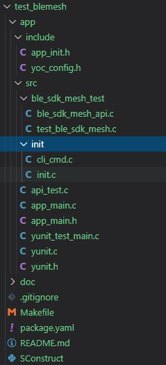
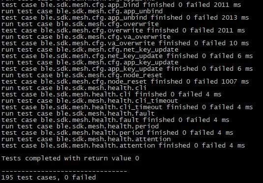

# BLE MESH 测试操作手册

## 1. 概要

操作手册分为环境准备和测试BLE MESH API两部分内容。环境准备主要介绍测试环境中所需的软硬件工具准备和安装。测试章节主要介绍程序编译及其编译前的准备工作，以及测试执行前的准备工作和执行中的具体操作步骤，明确具体的测试结果。

本操作文档以PHY6220为例。

## 2. 环境准备

### 2.1硬件准备

| 设备   | 数量 | 功用                     |
| ------ | ---- | ------------------------ |
| PC     | 1    | 测试人员代码编写以及运行 |
| 开发板 | 1    | 测试对象                 |
| 串口线 | 2    | 烧写及查看log日志        |

### 2.2工具软件准备

| 软件名称        | 版本     | 功用   | 下载链接                                                     |
| --------------- | -------- | ------ | ------------------------------------------------------------ |
| 工具链          | V3.10.21 | 编译   | https://occ.t-head.cn/community/download?id=3782044712072974336 |
| CskyDebugServer | V5.10.4  | 调试用 | https://occ.t-head.cn/community/download_detail?id=616215132330000384 |

在Ubuntu子系统中（下列操作除了强调Windows客户端以外，其他操作都在Ubuntu子系统中完成），将工具链加入到环境变量中，例如csky-elfabiv2-tools-x86_64-minilibc-20200502.tar.gz解压后存放在自定义目录下，可在 该目录下找到 csky-elfabiv2-tools-x86_64-minilibc-20200502文件夹，文件夹内有 bin 文件夹， 将 bin 文件夹路径加入到环境变量。

将该路径加入到环境变量，执行命令： 

```yaml
export PATH=$PATH: /mnt/d/tools/csky-abiv2-elf-gcc/bin
```

将上述命令的路径替换为工具链实际所在目录路径即可。

### 2.3 开发板连接CskyDebugServer 

使用时，将串口和仿真接口通过数据线连接到电脑 USB 接口。在 windows 桌面双击打开 CskyDebugServer，连接开发板，连接成功会显示以下内容： 


## 3. 测试

**以PHY6220为例。**

下载yoc代码。目录如下

```shell
mkdir temp
cd temp
sudo pip install yoctools
yoc init git@gitlab.alibaba-inc.com:thead_test_solutions/manifest.git
yoc install test_blemesh_api
cd solutions/test_blemesh_api
```

测试代码目录



### 3.1 package.yaml修改

**首先需要修改测试代码目录下的package.yaml。主要需要修改以下4处：**

**1、修改依赖board。**

 将solution字段的board_name改为实际测试的board组件。

```c
solution:
  board_name: phy6220_evb                  //改为实际测试的board组件
```

**2、修改依赖组件。**

 将depends字段的phy6220_evb改为实际测试的board组件，再添加实际测试需要依赖的组件。

以phy6220_evb为例：

```yaml
depends:                                //可在该字段下添加实际测试需要依赖的组件
  - rhino: v7.4.0
  - minilibc: v7.4.0
  - aos: v7.4.0
  - console: v7.4.0
  - drivers: v7.4.0
  - uservice: v7.4.0
  - ulog: v7.4.0
  - ble_mesh: v7.4.0
  # board components
  - phy6220_evb: v7.4.0                                //改为实际测试的board组件
```

**3、修改编译参数**

由于phy6220_evb资源有限，需先将def_config字段的CONFIG_MESH_SDK_PART2先注释掉，运行第一遍；

然后注释CONFIG_MESH_SDK_PART1，打开CONFIG_MESH_SDK_PART2再运行第二遍。

```yaml
def_config:
  CONFIG_KV_SMART: 1
  CONFIG_BT: 1
  CONFIG_CLI: 1
  CONFIG_KERNEL_RHINO: 1
  CONFIG_BT_L2CAP_RX_MTU: 31
  CONFIG_BT_L2CAP_TX_MTU: 31
  CONFIG_INIT_TASK_STACK_SIZE: 1024
  CONFIG_KERNEL_TIMER_STACK_SIZE: 1024
  CONFIG_CLI_TASK_STACK_SIZE: 1024
  CONFIG_BLE_MESH_PROV: 1
  CONFIG_BT_MESH_IV_UPDATE_TEST: 1
  CONFIG_BT_MESH_CFG_CLI: 1
  CONFIG_BT_MESH_GATT_PROXY: 1
  CONFIG_BT_MESH_HEALTH_CLI: 1
  CONFIG_BT_MESH_USE_SIG_MODEL: 1
  CONFIG_BT_MESH_MODEL_GEN_ONOFF_SRV: 1
  CONFIG_BT_MESH_MODEL_GEN_LEVEL_SRV: 1
  CONFIG_BT_MESH_MODEL_LIGHT_LIGHTNESS_SRV: 1
  CONFIG_BT_MESH_MODEL_LIGHT_CTL_SRV: 1
  CONFIG_BT_MESH_MODEL_GEN_ONOFF_CLI: 1
  CONFIG_BT_MESH_MODEL_GEN_LEVEL_CLI: 1
  CONFIG_BT_MESH_MODEL_LIGHT_LIGHTNESS_CLI: 1
  CONFIG_BT_MESH_MODEL_LIGHT_CTL_CLI: 1
  CONFIG_BT_MESH_MODEL_VENDOR_SRV: 1
  CONFIG_BT_MESH_MODEL_VENDOR_CLI: 1
  CONFIG_MESH_SDK_PART1: 1    #第一次测试开启这个宏，关闭CONFIG_MESH_SDK_PART2
  # CONFIG_MESH_SDK_PART2: 1  #第二次测试开启这个宏，关闭CONFIG_MESH_SDK_PART1
  CONFIG_BOARD_PHY6220: 1
```

**4、修改board初始化代码**

修改测试代码目录下app/src/init/init.c

- 修改串口端口

```c
//配置测试用的串口端号
#define CONSOLE_IDX 0                 //实际所用的uart的idx值
```

- 修改测试所用的驱动

```c
void board_yoc_init()
{
    int ret;
    board_init();
    console_init(CONSOLE_UART_IDX, 115200, 512);

    ulog_init();
    aos_set_log_level(AOS_LL_DEBUG);
    LOGI(TAG, "Build:%s,%s",__DATE__, __TIME__);

    /* load partition */
    ret = partition_init();
    if (ret <= 0) {
        LOGE(TAG, "partition init failed");
    } else {
        LOGI(TAG, "find %d partitions", ret);
    }

    /* kvfs init */
    aos_kv_init("kv");

    extern int hci_driver_phy6220_register(int idx);
    extern int hci_h4_driver_init();
    hci_driver_phy6220_register(0); //修改为实际所用驱动
    hci_h4_driver_init();

    /* cli init */
    board_cli_init(NULL);
}
```

### 3.3 程序编译及烧写

**1、编译。**

测试目录下执行make命令编译程序：

```shell
make clean;make
```

编译成功后会在目录下的generated内生成images.zip。

**2、烧写。**

烧录之前我们有个准备工作需要做一下：

测试目录下创建一个.gdbinit，文件中放入如下内容:

```shell
target remote 172.31.0.196:1025
```

.gdbinit文件中的ip 地址从 CskyDebugServer 打印中获取, 连接 CskyDebugServer 步骤详情请见2.3节 。

测试目录下执行烧写命令：

```shell
make flashall
```

### 3.4 测试执行

**1、烧录测试代码后，重启板子，看到打印Welcome to CLI...，说明已进入测试状态。**

```shell
Welcome to CLI...
> 
```

**2、发送指令进行测试**

API测试：

通过串口软件发送api测试命令：

```shell
test blemeshapi
```

串口终端会打印测试数据。

