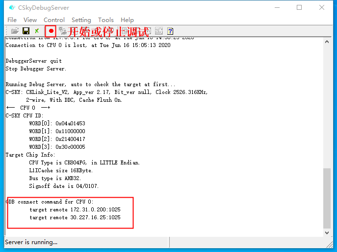
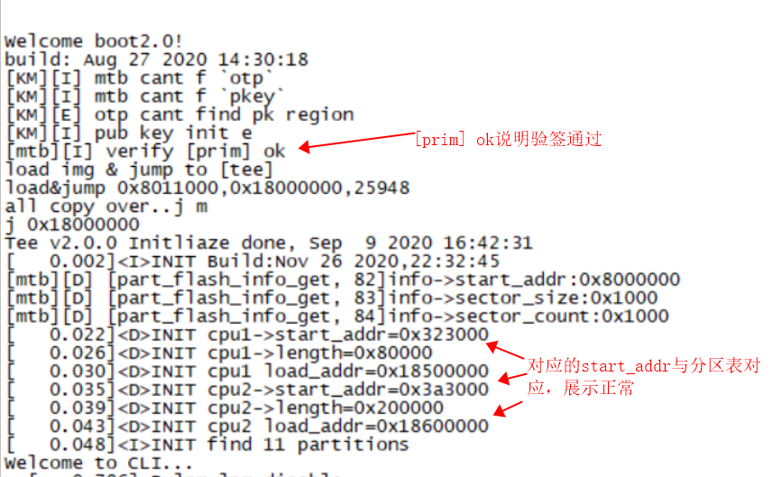
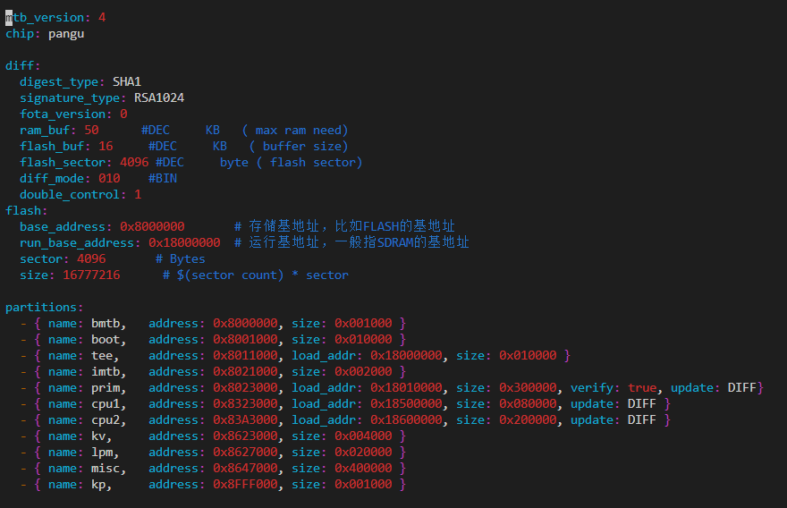

# bootloader测试操作手册

## 1. 概要

操作手册分为环境准备和测试bootloader两部分内容。环境准备主要介绍测试环境中所需的软硬件工具准备和安装。测试章节主要介绍程序编译及其编译前的准备工作，以及测试执行前的准备工作和执行中的具体操作步骤，明确具体的测试结果。


## 2. 环境准备

### 2.1硬件准备

| 设备   | 数量 | 功用              |
| ------ | ---- | ----------------- |
| 开发板 | 1    | 测试对象          |
| 串口线 | 1    | 烧写及查看log日志 |
| PC     | 1    | 编译代码          |


### 2.2工具软件准备

| 软件名称        | 版本     | 功用   | 下载链接                                                     |
| --------------- | -------- | ------ | ------------------------------------------------------------ |
| 工具链          | V3.10.21 | 编译   | https://www.xrvm.cn/community/download?id=3782044712072974336 |
| CskyDebugServer | V5.10.4  | 调试用 | https://www.xrvm.cn/community/download_detail?id=616215132330000384 |

​    在Ubuntu子系统中（下列操作除了强调Windows客户端以外，其他操作都在Ubuntu子系统中完成），将工具链加入到环境变量中，例如csky-elfabiv2-tools-x86_64-minilibc-20200502.tar.gz解压后存放在自定义目录下，可在 该目录下找到 csky-elfabiv2-tools-x86_64-minilibc-20200502文件夹，文件夹内有 bin 文件夹， 将 bin 文件夹路径加入到环境变量。

将该路径加入到环境变量，执行命令： 

```yaml
export PATH=$PATH: /mnt/d/tools/csky-abiv2-elf-gcc/bin
```

将上述命令的路径替换为工具链实际所在目录路径即可。


### 2.3 开发板连接CskyDebugServer 

使用时，将串口和仿真接口通过数据线连接到电脑 USB 接口。在 windows 桌面双击打开 CskyDebugServer，连接开发板，连接成功会显示以下内容： 




## 3. 测试

安装bootloader测试例程：

```
yoc install test_bootloader
```

bootloader含两个功能：1.引导启动功能   2.差分全量升级功能

一般情况boot文件在boards/XXX/XXX/bootimgs下，如需替换boot文件，需要下载开发提供的XXX_boot solution文件，编译再替换过去

- 系统正常引导起来日志：

  


- boot分区表所在目录为：boards/XXX/XXX/configs/config.yaml，分区展示例子：



字段介绍：

| 字段           | 说明                   |
| -------------- | ---------------------- |
| soft_version   | 软件版本号             |
| mtb_version    | mtb格式版本号          |
| chip           | 芯片类型               |
| signature_type | 签名算法               |
| digest_type    | 摘要算法               |
| diff           | 用于差分相关的配置参数 |
| flash          | flash相关参数          |
| partitions     | 分区表相关参数         |

| diff           | 是否必选 | 说明                                                      |
| -------------- | -------- | --------------------------------------------------------- |
| ram_buf        | 是       | 差分还原时所需的ram空间，单位KB                           |
| flash_buf      | 是       | 差分还原时所需的flash空间，单位KB                         |
| flash_sector   | 是       | flash每个sector的尺寸，单位byte                           |
| diff_mode      | 是       | 差分模式,二进制字符串                                     |
| double_control | 否       | 是否使用双flash，此字段不填或者0：单片flash，1：双片flash |

| 分区 | 说明                               |
| ---- | ---------------------------------- |
| imtb | 分区表，包含所有分区位置及安全信息 |
| tee  | 安全执行镜像                       |
| boot | bootloader                         |
| prim | 应用镜像                           |
| misc | 升级备份区                         |
| lpm  | 低功耗信息保存区                   |
| otp  | 只读分区，存放设备信息及安全密钥   |


### 3.1 程序编译及烧写

**1、编译。**

测试目录下执行make命令编译程序：

```c
make clean;make
```

编译成功后会在目录下的generated内生成images.zip。


**2、烧写。**

烧录之前我们有个准备工作需要做一下：

测试目录下创建一个.gdbinit，文件中放入如下内容:

```c
target remote 172.31.0.196:1025
```

.gdbinit文件中的ip 地址从 CskyDebugServer 打印中获取, 连接 CskyDebugServer 步骤详情请见2.3节 。

测试目录下执行烧写命令：

```c
make flashall
```


**3、制作升级包。**

利用product工具，做成升级包fota.bin，进行升级。注意要有待烧写的elf文件

区分差分升级和全量升级

分区表里的update字段，DIFF代表差分，FULL代表全量

```
- { name: prim,   address: 0x8023000, load_addr: 0x18010000, size: 0x300000, verify: true, update: DIFF}
```

给镜像包打标签（标志一个版本，在日志中有体现）：

```
product image generated/images2.zip -l -v '2000'
```

生成升级包fota.bin：

```
product diff -f generated/images1.zip generated/images2.zip -v '2000' -o fota.bin
```

烧录整个镜像包：

```
product flash generated/images1.zip -a
```

烧录fota.bin到misc分区（ps：需要烧录到misc偏移2个sector位置）

擦除某个分区（如misc）：

```
product flash generated/images1.zip -e misc
```

烧录fota.bin：

```
product flashbin fota.bin 0x8649000 -f PanGu_CK804EF_QSPIFLASH_CDK-1buf-efuse-product.elf
```


### 3.2 bootloader Function 测试

按照bootloader_testcase里面的测试步骤，进行测试。


