# TEST_CSI1.0 SOLUTION操作介绍

**一、CDK工具操作**<br />**1.概要**<br />操作手册分为环境准备和测试两部分内容。环境准备主要介绍测试环境中所需的软硬件工具准备和安装。测试章节主要介绍程序编译及其编译前的准备工作，以及测试执行前的准备工作和执行中的具体操作步骤，明确具体的测试结果。<br />**2.环境准备**<br />**2.1硬件准备**<br />电脑×1，测试开发板（CH2201）×2，电源线×2，连接DebugServer数据线×2，USB转串口线×2<br />**2.2工具软件准备**<br />1.电脑安装CDK工具，CDK工具下载地址：[https://www.xrvm.cn/activities/cdk](https://www.xrvm.cn/activities/cdk)<br /><br /><br />**2.3工程创建**<br />2.3.1打开CDK，进入到CDK工具页面<br />2.3.2点击工具栏的Project->New IoT Project<br />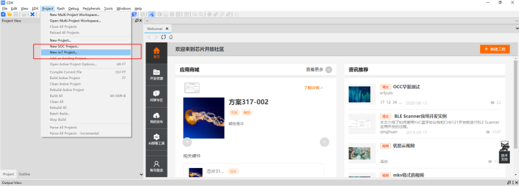<br />2.3.3创建Workspace Name，选择保存路径，并点击OK<br /><br />2.3.4在弹出来的“IoT Project Wizard”窗口中，选择：玄铁-》chip_pangu（这里测试的开发板是pangu,因此这里选择chip_ch2201，若为其他芯片，则需要选择其他），并点击Next<br />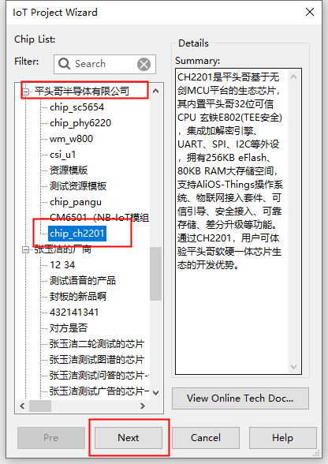<br />2.3.5选择“CB2201”，并点击Next<br />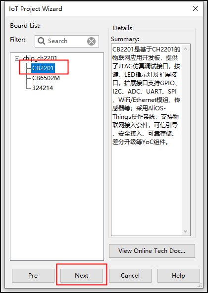<br />2.3.6选择第二个工程,并点击Finish<br />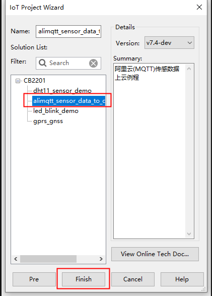<br />2.3.7等待加载完成，CDK工程就创建成功<br />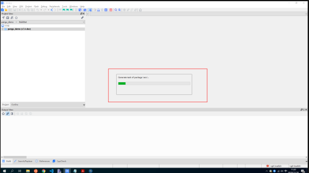<br />**3.文件结构介绍**<br />**3.1app\include\csi\driver**<br />###csi1.0代码头文件（此处无需修改）<br />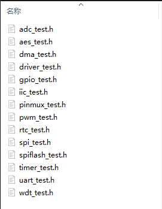<br />**3.2app\src\csi\driver**<br />###csi1.0测试代码源文件（此处无需修改）<br />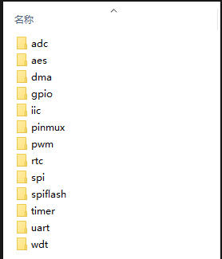<br />**3.3driver_tests_main.c和app_main.c**<br />驱动测试入口函数（此处无需修改）<br /><br />**3.4doc目录**（此处无需修改，其中USER_GUIDE.md为test_csi1.0 solution用户操作指南）<br />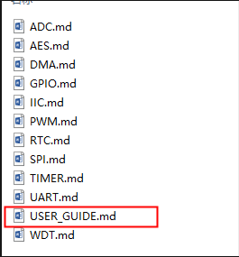<br />**3.5宏开关**

```yaml
def_config:
  CONFIG_ARCH_INTERRUPTSTACK: 1024
  CONFIG_CLI: 1
  CONFIG_DEBUG: 3
  CONFIG_TEE_CA: 1
#  CONFIG_SYSTEM_SECURE: 1
  CONFIG_INIT_TASK_STACK_SIZE: 2048
# CONFIG_KERNEL_NONE: 1
  CONFIG_UART: 1
  CONFIG_WDT: 1
#  CONFIG_GPIO: 1
#  CONFIG_AES: 1
#  CONFIG_DMA: 1
#  CONFIG_IIC: 1
#  CONFIG_PWM: 1
#  CONFIG_RTC: 1
#  CONFIG_SPI: 1
#  CONFIG_SPIFLASH: 1
#  CONFIG_TIMER: 1
#  CONFIG_ADC: 1
```
**4.操作过程****<br />**4.1编译**<br />（1）方法一：点击CDK工具中的build<br />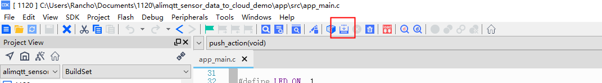<br />（2）方法二：鼠标右击工程选择rebuild<br />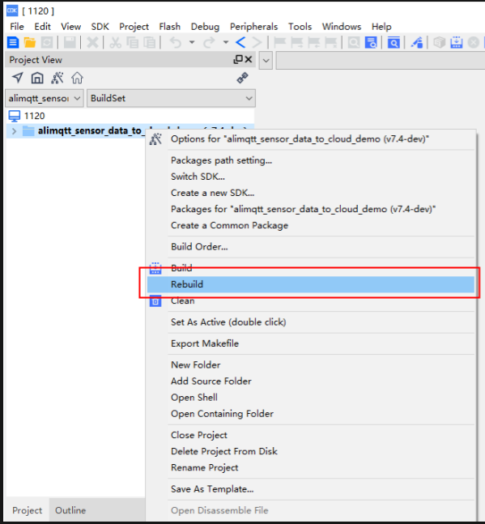<br />（3）编译成功后，如图所示：<br /><br />**4.3加载elf文件**<br />（1）打开CDK工具的命令行窗口，如图所示：<br />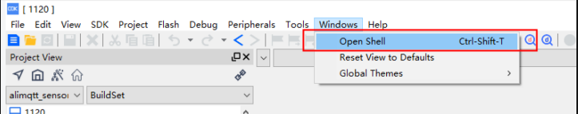<br />（2）打开后如图所示：<br /><br />（3）进入到工程下的Obj文件夹：<br /><br />（4）使用CSKY工具加载elf文件

```yaml
C:\Users\Rancho\Documents\1116\ch2201_demo\Obj>Call csky-elfabiv2-gdb ./ch2201_demo.elf
```
（5）加载第一块开发板<br />##这里以加载到远程服务器上的开发板为例，输入Call csky-elfabiv2-gdb ./ch2201_demo.elf，然后在gdb命令中输入target remote 172.16.201.173:1045，回车确认输入并连接开发板，打开串口工具，连接<br /><br />（6）然后输入命令lo<br />（7）加载完成之后再输入c<br /><br />（8）成功之后串口打印log如图所示：<br /><br />（9）加载第二块开发板<br />##这里以加载到远程服务器上的开发板为例，重新打开一个新的命令行窗口，同样进入到Obj目录下，输入Call csky-elfabiv2-gdb ./ch2201_demo.elf，然后在gdb命令输入target remote 172.16.201.173:1050，回车确认输入并连接开发板，打开串口工具，连接<br /><br />（10）然后输入命令lo<br />（11）加载完成之后再输入c<br />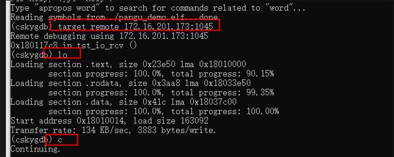<br />（12）成功之后串口打印log如图所示：<br /><br />**4.4烧写**<br />（1）配置烧写路径：点击工具栏Flash-》Configure Flash Tool -》Debug<br /><br /><br />##这里以下载到远程服务器为例，选择Remote ICE-》Settings，输入IP：172.16.201.173   PORT：1050，点击OK,当第一次烧写成功以后，将程序烧写到另外一块开发板上，再重新输入ip和PORT，这里第二块板子的IP：172.16.201.173   PORT：1045<br />（2）烧写第一块开发板<br /><br />（3）点击load

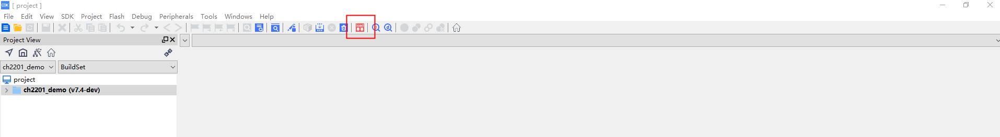<br />（4）正在烧录：<br />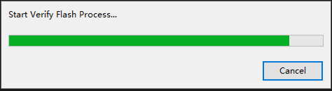

（5）烧录成功：<br /><br />（6）烧写第二块开发板<br /><br />（7）点击load<br />（8）正在烧录：<br />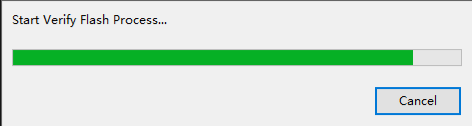

（9）烧录成功：<br />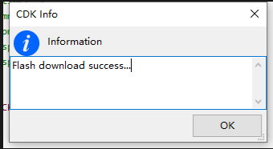<br />**4.5执行**<br />（1）打开串口工具，连接两块开发板<br /><br /><br />（2）两块开发板分别按下复位键，板子启动<br />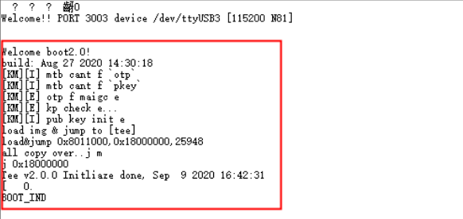<br />（3）进行模块的AT指令测试<br />**5.示例**<br />**5.1csi1.0版本的UART模块测试示例**<br />###以UART模块为例，对UART进行异步收发测试###<br />（1）将A板和B板的PB24 PB25用连接线交叉连接，如下图所示：<br />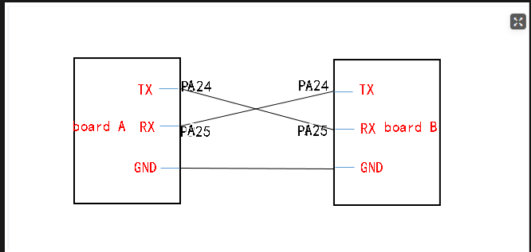<br />（2）打开csi1.0版本的UART宏开关
```yaml
def_config:
  CONFIG_UART: 1
```
（3）修改编译版本<br />（3-1）选择你所测试的芯片名字，右击选择Options for "chip_ch2201(v7.4-dev)"(这里测试芯片是ch2201，所以在chip_ch2201(v7.4-dev)上右击），如下图所示：<br />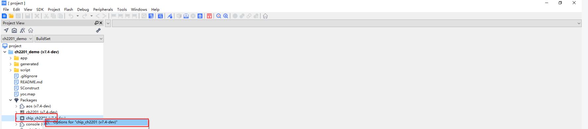<br />（3-2）设置测试版本：这里配置chip_ch2201为csi1.0版本，配置如下：<br /><br />
<br />（4）编译<br />（4-1）点击工程选择build<br />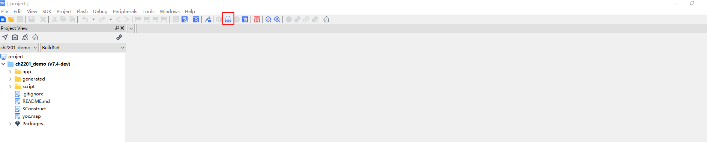<br />（4-2）编译成功如图：<br /><br />（5）烧写<br />（5-1）配置烧写路径：点击工具栏Flash-》Configure Flash Tool -》Debug<br /><br />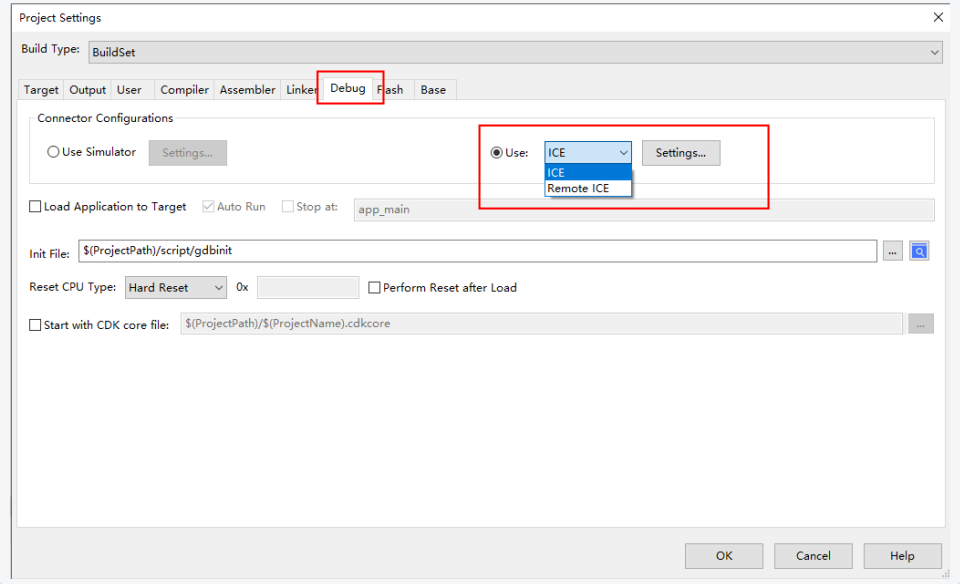<br />##这里以下载到远程服务器为例，选择Remote ICE-》Settings，输入IP：172.16.201.173   PORT：1050，点击OK,当第一次烧写成功以后，将程序烧写到另外一块开发板上，再重新输入ip和PORT，这里第二块板子的IP：172.16.201.173   PORT：1045<br />（5-2）烧写第一块开发板<br /><br />（5-3）点击load<br />（5-4）正在烧录：<br />

（5-5）烧录成功：<br />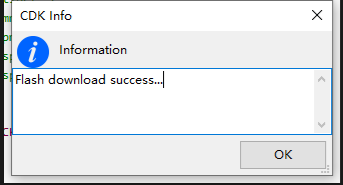<br />（5-6）烧写第二块开发板<br />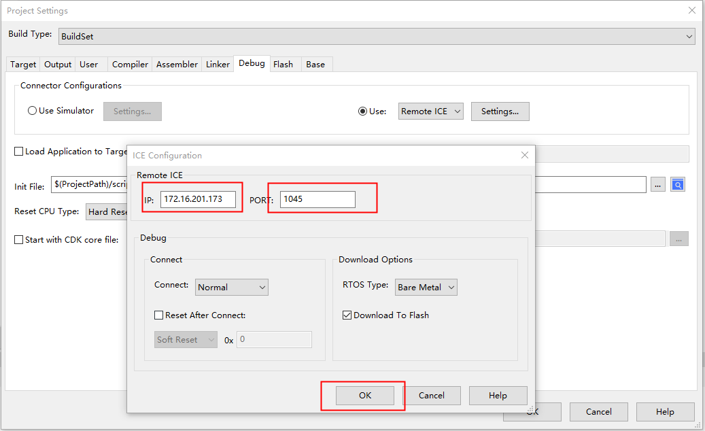<br />（5-7）点击load<br />（5-8）正在烧录：<br />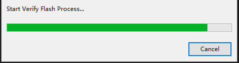

（5-9）烧录成功：<br /><br />（6）开发板启动<br />（6-1）打开串口工具，连接两块开发板<br />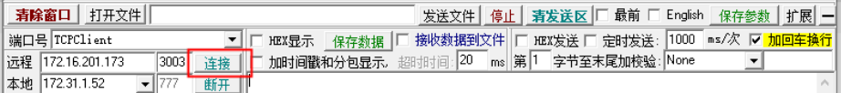<br /><br />（6-2）两块开发板分别按下复位键，板子启动成功<br /><br />（7）AT命令测试<br />（7-1）分别使用AT+PINMUX_CONFIG指令将A板和B板对应的PA24、PA25引脚复用成UART功能引脚，成功后A板、B板打印如下log<br />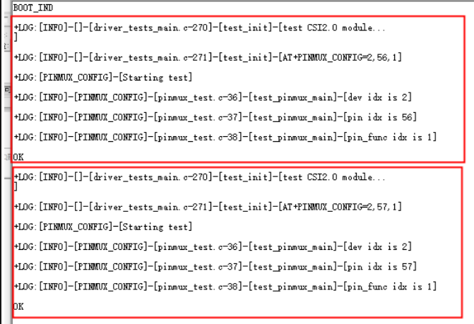<br />（7-2）向A板发送AT+UART_ASYNC_RECEIVE=9600,2,2,0,0（UART异步接收指令：参数1：波特率，参数2：数据位个数，参数3：校验位个数，参数4：停止位个数，参数5：流控）指令，打印Ready后向B板发送指令AT+UART_ASYNC_SEND=9600,2,2,0,0UART异步发送指令：参数1：波特率，参数2：数据位个数，参数3：校验位个数，参数4：停止位个数，参数5：流控），测试完成后，A板和B板都会打印OK，即为测试成功<br />》》》向A板发送AT+UART_ASYNC_RECEIVE=9600,2,2,0,0指令后打印如下log：<br /><br />》》》再向B板发送AT+UART_ASYNC_SEND=9600,2,2,0,0指令，打印如下log：<br />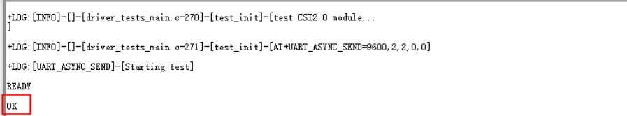<br />》》》测试完成后，A板和B板都会打印OK，即为测试成功,对应log如下：<br />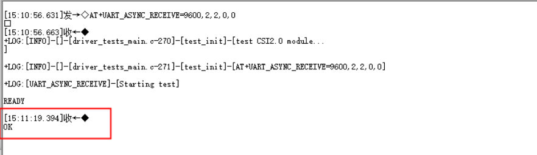<br />**<br />**6.文件索引**<br />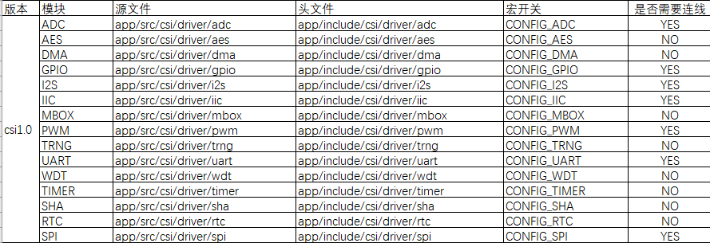<br />**二、命令行操作**<br />**1.概要**<br />操作手册分为环境准备和测试两部分内容。环境准备主要介绍测试环境中所需的软硬件工具准备和安装。测试章节主要介绍程序编译及其编译前的准备工作，以及测试执行前的准备工作和执行中的具体操作步骤，明确具体的测试结果。<br />**2.环境准备**<br />2.1硬件准备<br />电脑×1，测试开发板（CH2201）×2，电源线×2，连接DebugServer数据线×2，USB转串口线×2<br />2.2工具软件准备<br />1）在Linux系统下安装yoctools工具，版本大于2.0.X版本，yoctools安装命令：
```yaml
sudo pip install yoctools
```
2）新建一个文件夹demo，用来下载solution
```yaml
mkdir demo
```
3）在此目录下初始化yoc
```yaml
yoc init git@gitlab.alibaba-inc.com:thead_test_solutions/manifest.git
```
4）查看所有solution
```yaml
yoc list -r -s
```
5）下载solution
```yaml
yoc install test_csi1 #以test_csi1为例
```
下载成功出现如图所示的三个文件夹：<br />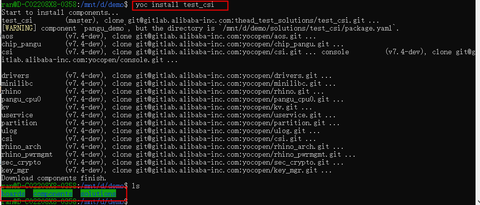<br />3.示例<br />3.1csi1.0版本的WDT模块测试示例<br />###以WDT模块为例，测试在设定时间内的WDT的复位功能###<br />1）修改test_csi1/package.yaml文件：进入solutions/test_csi1
```yaml
ran@D-C02208X8-0358:/mnt/d/demo/solutions/test_csi1$ vi package.yaml
```
2）在package.yaml文件的build_config/include将所要测试版本的头文件和源文件包含，并且在def_config下打开所需的宏开关，如需要测试WDT模块，需要打开对应模块的宏开关，最后build_config/include、build_config/source_file和def_config设置如下：<br />build_config/include设置：（此处无需修改）
```yaml
# 编译参数
build_config:
  include:
    - app/include
    - app/include/csi/atserver
    - app/include/csi/common
    - app/include/csi/driver
```
build_config/source_file设置：（此处无需修改）
```yaml
source_file:
  - app/src/app_main.c
  - app/src/driver_tests_main.c 
  - app/src/init/*.c
  - app/src/csi/common/*.c 
  - app/src/csi/atserver/*.c 
  - app/src/csi/driver/dma/*.c ? <CONFIG_DMA>
  - app/src/csi/driver/gpio/*.c ? <CONFIG_GPIO>
  - app/src/csi/driver/iic/*.c ? <CONFIG_IIC>
  - app/src/csi/driver/pinmux/*.c 
  - app/src/csi/driver/pwm/*.c ? <CONFIG_PWM>
  - app/src/csi/driver/rtc/*.c ? <CONFIG_RTC>
  - app/src/csi/driver/spi/*.c ? <CONFIG_SPI>
  - app/src/csi/driver/spiflash/*.c ? <CONFIG_SPIFLASH>
  - app/src/csi/driver/timer/*.c ? <CONFIG_TIMER>
  - app/src/csi/driver/uart/*.c ? <CONFIG_UART>
  - app/src/csi/driver/wdt/*.c ? <CONFIG_WDT>
  - app/src/csi/driver/aes/*.c ? <CONFIG_AES>
  - app/src/csi/driver/adc/*.c ? <CONFIG_ADC>
```
def_config设置：
```yaml
def_config:
  CONFIG_CLI: 1
  CONFIG_DEBUG: 3
#  CONFIG_DMA: 1
  CONFIG_INIT_TASK_STACK_SIZE: 2048 
  CONFIG_ARCH_INTERRUPTSTACK: 1024
  CONFIG_TEE_CA: 1
#  CONFIG_SYSTEM_SECURE: 1
# CONFIG_KERNEL_NONE: 1
#  CONFIG_UART: 1
  CONFIG_WDT: 1
#  CONFIG_GPIO: 1
#  CONFIG_AES: 1
#  CONFIG_DMA: 1
#  CONFIG_IIC: 1
#  CONFIG_PWM: 1
#  CONFIG_RTC: 1
#  CONFIG_SPI: 1
#  CONFIG_SPIFLASH: 1
#  CONFIG_TIMER: 1
#  CONFIG_ADC: 1
```
3）确认版本信息：进入components/chip_ch2201目录（这里是以CH2201开发板为例，因此需要进入此目录，若为其他开发板，需要进入对应的芯片目录），确认package.yaml文件中版本信息
```yaml
ran@D-C02208X8-0358:/mnt/d/demo/components/chip_ch2201$ vi package.yaml
```
4）确认信息如下：
```yaml
def_config:                              # 组件的可配置项
   CONFIG_CSI_V1: 1
   CONFIG_CSI: "csi1"
```
5)进入boards/cb2201/include/目录下，修改k_config.h中的CSK_CPU_STACK_EXTRAL大小如下图所示：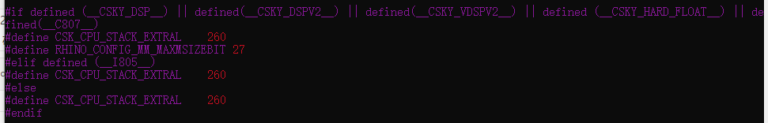<br />4）编译<br />》》》进入solutions/test_csi1/目录，执行make命令

```yaml
ran@D-C02208X8-0358:/mnt/d/demo/solutions/test_csi1$ make clean;make
```
5）编译成功如图所示：<br />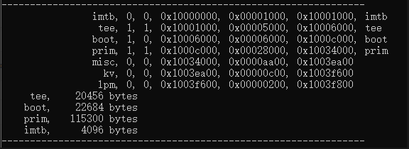<br />6）加载<br />》》》新建.gdbinit文件，内容如下：<br />备注：因测试用开发板位于远程，IP地址为172.16.201.173，PORT为1050，所以设置如下：

```yaml
target remote 172.16.201.173:1055
set $pc=Reset_Handler
```
》》》加载elf文件到对应开发板中，执行命令如下:<br />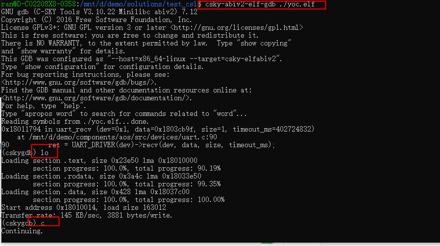<br />7）打开串口<br /><br />开发板启动成功，打印如下log<br /><br />8）对WDT模块进行功能测试<br />（1）测试WDT模块的超时复位功能：<br />发送命令AT+WDT_TIMEOUT_RESET=0,200（WDT模块的超时复位功能：参数1：设备号，参数2：超时时间）到A板，测试完成后， A板对应串口会打印OK；否则测试失败，测试成功打印log如下：<br />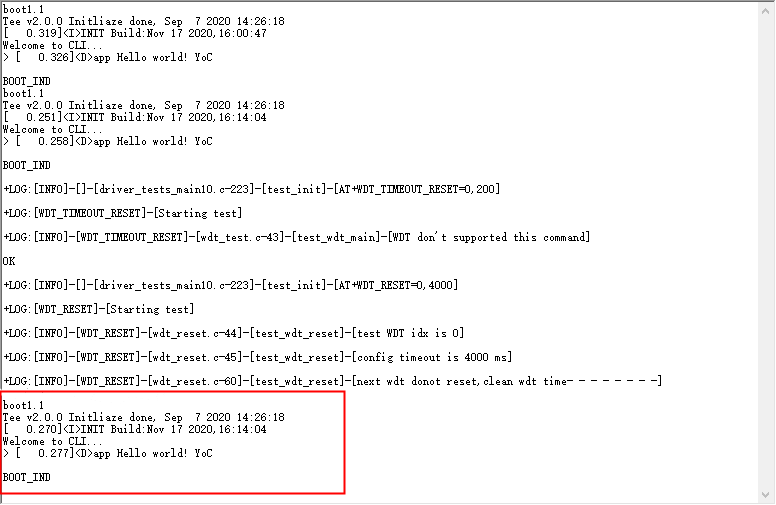<br />4.文件索引<br />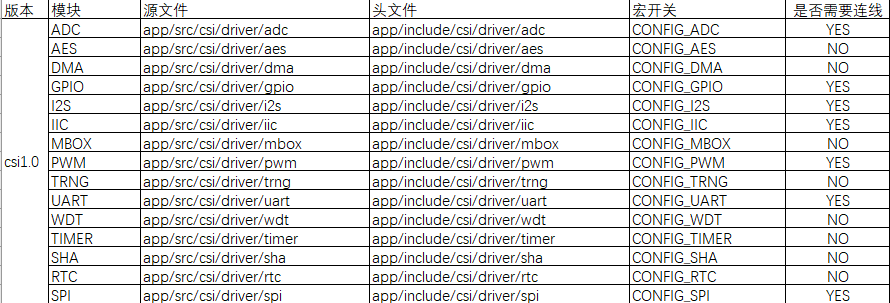

**三、结果**

用户自测之后，将测试结果按下图格式填入doc/example目录下的word文档中

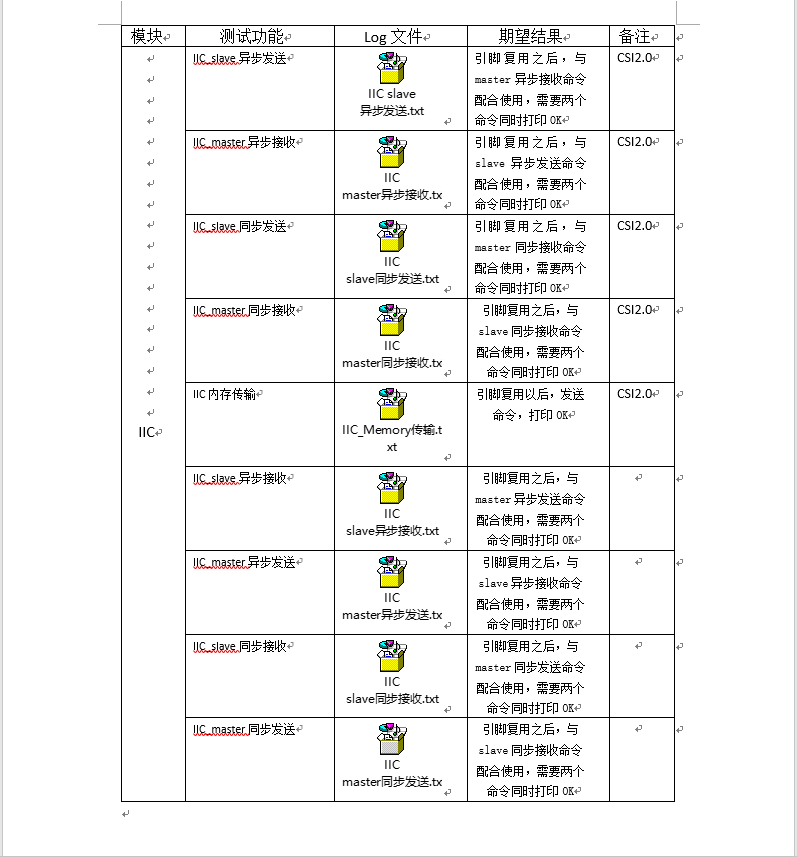
