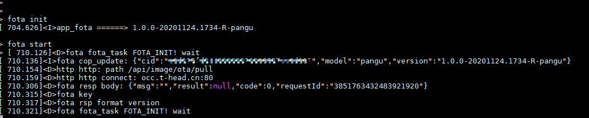
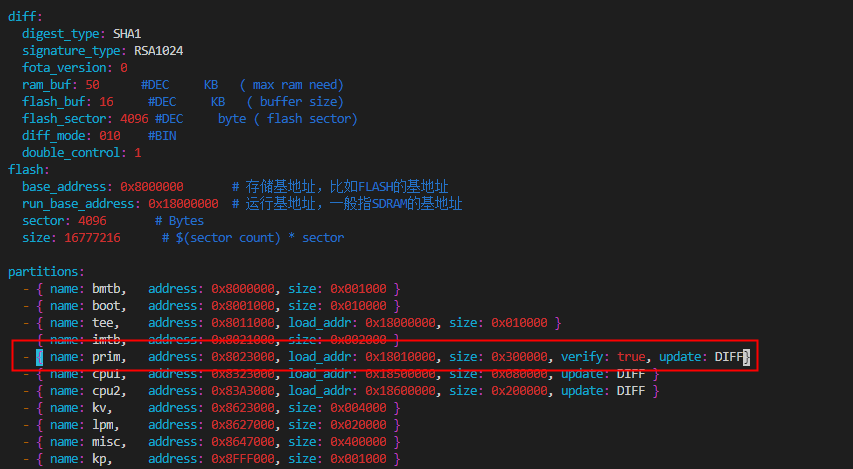
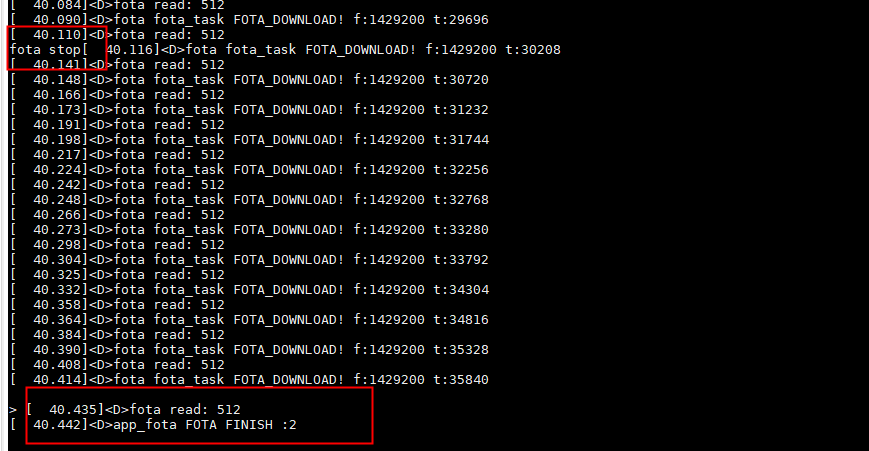
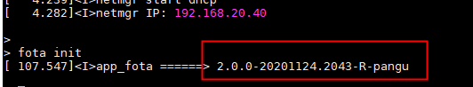
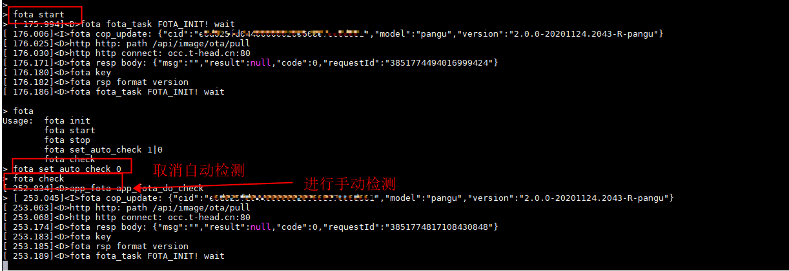
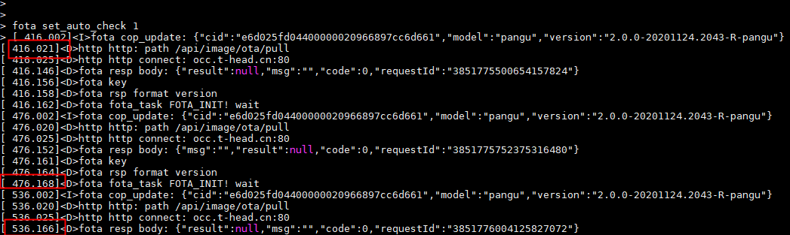

# FOTA交付测试结果规范

## 1. 升级配置

详情参考：操作手册3.4测试执行

1. 网络连接
2. 设备id配置
3. 产品类型配置
4. fota服务器配置，默认为occ

## 2. API测试执行

命令：test fotaapi

注意：在测试api时，云端不要存放高版本

提交如下图所示截图：

## 3. FUNC测试

### 云端无版本时进行检测

前提：云端无升级版本上传

命令： fota init；fota start

提交如下图所示截图：

### 云端存在版本时检测版本

前提：云端存在高版本，具体参考操作文档

命令： fota init；fota start

提交如下图所示截图：

### 下载完毕收升级

前提：云端存在高版本，具体参考操作文档

命令 fota init；fota start

提交如下图所示截图：

### 配置全量升级

前提：云端存在高版本，具体参考操作文档

 修改config.yaml,CPU0分区为全量升级

命令： fota init；fota start

提交如下图所示截图：

### 配置差分升级

前提：云端存在高版本，具体参考操作文档

修改config.yaml CPU0分区为差分升级

提交如下图所示截图：

### 升级下载过程中取消升级

前提：云端存在高版本，具体参考操作文档（最好为全量升级包）

命令： fota init；fota start；fota stop

提交如下图所示截图：

升级成功后查看版本：

### 关闭自动检测

命令：fota set_auto_check 0；fota check

提交如下图所示截图：

### 开启自动检测

命令：fotfota set_auto_check 1

隔1min检测1次

提交如下图所示截图：

