# FOTA测试操作手册

## 1. 概要

操作手册分为环境准备和测试FOTA两部分内容。环境准备主要介绍测试环境中所需的软硬件工具准备和安装。测试章节主要介绍程序编译及其编译前的准备工作，以及测试执行前的准备工作和执行中的具体操作步骤，明确具体的测试结果。

本操作文档以PANGU为例。

具体文档详见：https://yoc.docs.t-head.cn/yocbook/Chapter5-%E7%BB%84%E4%BB%B6/%E7%B3%BB%E7%BB%9F%E5%8D%87%E7%BA%A7/


## 2. 环境准备

### 2.1硬件准备

| 设备   | 数量 | 功用                     |
| ------ | ---- | ------------------------ |
| PC     | 1    | 测试人员代码编写以及运行 |
| 开发板 | 1    | 测试对象                 |
| 串口线 | 2    | 烧写及查看log日志        |


### 2.2工具软件准备

| 软件名称        | 版本     | 功用           | 备注                                                         |
| --------------- | -------- | -------------- | ------------------------------------------------------------ |
| 工具链          | V3.10.21 | 编译           | 下载命令 sudo yoc toolchain -c (下载和安装csky工具链)        |
| CskyDebugServer | V5.10.4  | 调试用         | https://occ.t-head.cn/community/download_detail?id=616215132330000384 |
| OCC             |          | 升级包管理升级 | https://occ.t-head.cn/                                       |


### 2.3 开发板连接CskyDebugServer 

使用时，将串口和仿真接口通过数据线连接到电脑 USB 接口。在 windows 桌面双击打开 CskyDebugServer，连接开发板，连接成功会显示以下内容： 


## 3. 测试

**以PANGU为例。**

下载yoc代码。目录如下

```shell
mkdir temp  #创建目录
cd temp  
sudo pip install yoctools #安装yoctools，已经安装可以跳过
yoc init git@gitlab.alibaba-inc.com:thead_test_solutions/manifest.git #yoc环境初始化
yoc install test_fota  #下载test_fota
cd solutions/test_fota  #进入test_fota应用中
```

测试代码目录

 

### 3.1 package.yaml修改

**首先需要修改测试代码目录下的package.yaml。主要需要修改以下2处。**


#### 修改依赖board

 将solution字段的board_name改为实际测试的board组件。

```yaml
hw_info:
  cpu_id: cpu0
  board_name: pangu_cpu0                  #改为实际测试的board组件
```


#### 修改依赖组件

 将depends字段的pangu改为实际测试的board组件，再添加实际测试需要依赖的组件。

以PANGU为例：

```yaml
depends:                                       # 该组件依赖其他的组件
  - minilibc: v7.4.0
  - aos: v7.4.0
  - rhino: v7.4.0
  - console: v7.4.0
  - drivers: v7.4.0
  - pangu_cpu0: v7.4.0                  #board相关组件，需要修改
  - netmgr: v7.4.0
  - lwip: v7.4.0
  - fota: v7.4.0
  - drv_wifi_rtl8723ds: v7.4.0          #网络驱动组件
  - drv_sdmmc: v7.4.0                   #网络驱动相关                    
```


### **3.2修改board初始化代码**

#### 分配misc分区

查看boards/pangu_cpu0/configs/config.yaml文件，用户需要进入自己的board中config.yaml

misc分区为升级包下载分区，注意misc分区必须大于升级镜像包

**update字段**：

```yaml
update: FULL   #本分区全量升级
update: DIFF   #本分区差分升级
```

```yaml
mtb_version: 4
chip: pangu

diff:
  digest_type: SHA1
  signature_type: RSA1024
  fota_version: 0
  ram_buf: 50      
  flash_buf: 16     
  flash_sector: 4096 
  diff_mode: 010    
  double_control: 1
flash:
  base_address: 0x8000000      
  run_base_address: 0x18000000  
  sector: 4096      
  size: 16777216      

partitions:
  - { name: bmtb,   address: 0x8000000, size: 0x001000 }
  - { name: boot,   address: 0x8001000, size: 0x010000 }
  - { name: tee,    address: 0x8011000, load_addr: 0x18000000, size: 0x010000 }
  - { name: imtb,   address: 0x8021000, size: 0x002000 }
  - { name: prim,   address: 0x8023000, load_addr: 0x18010000, size: 0x300000, verify: true, update: FULL}   #全量升级，CPU0分区
  - { name: cpu1,   address: 0x8323000, load_addr: 0x18500000, size: 0x080000, update: DIFF }           #差分升级，CPU1分区
  - { name: cpu2,   address: 0x83A3000, load_addr: 0x18600000, size: 0x200000, update: DIFF }         #差分升级，CPU2分区
  - { name: kv,     address: 0x8623000, size: 0x004000 }
  - { name: lpm,    address: 0x8627000, size: 0x020000 }
  - { name: misc,   address: 0x8647000, size: 0x400000 }
  - { name: kp,     address: 0x8FFF000, size: 0x001000 }
```


#### 初始化

```c
void board_yoc_init(void)
{
    board_init();                          
    event_service_init(NULL);              
    uart_csky_register(CONSOLE_UART_IDX);   
    spiflash_csky_register(0);

    console_init(CONSOLE_UART_IDX, 115200, 512); //console初始化（需要depends console组件）
    //CONSOLE_UART_IDX为打印串口
    ulog_init();                                 
    aos_set_log_level(AOS_LL_DEBUG);			

    int ret = partition_init();                 
    if (ret <= 0) {
        LOGE(TAG, "partition init failed");
    } else {
        LOGI(TAG, "find %d partitions", ret);
    }
    
    aos_kv_init("kv");                                                
    network_init();							  

    board_cli_init();                         
}
```


### 3.3 程序编译及烧写

#### 编译

测试目录下执行make命令编译程序：

```shell
make clean;make
```

编译成功后会在目录下的generated内生成images.zip。


#### 工厂镜像上传

- 进入控制台


- 进入产品

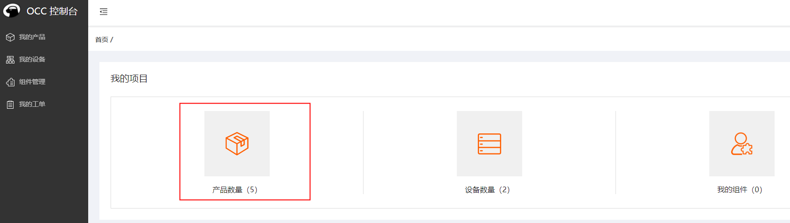

- 添加产品


- 配置产品型号和识别类型

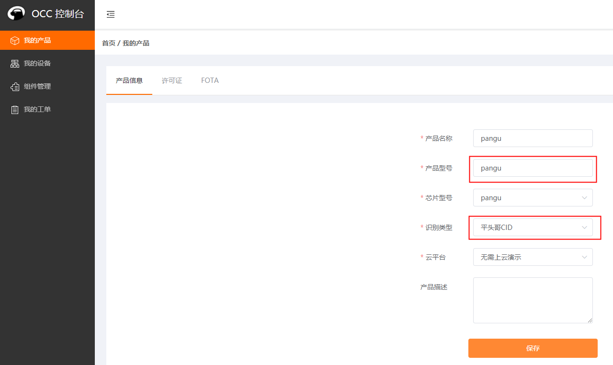

- 进入fota镜像列表

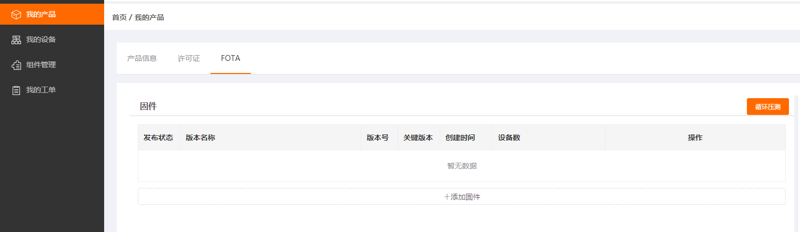

- 添加固件

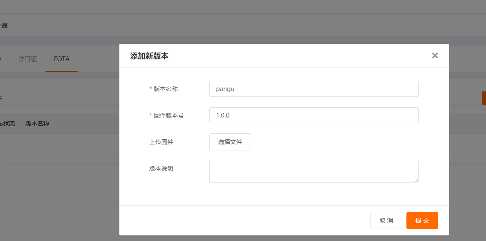

上传images.zip

- 发布升级包


- 下载烧写镜像

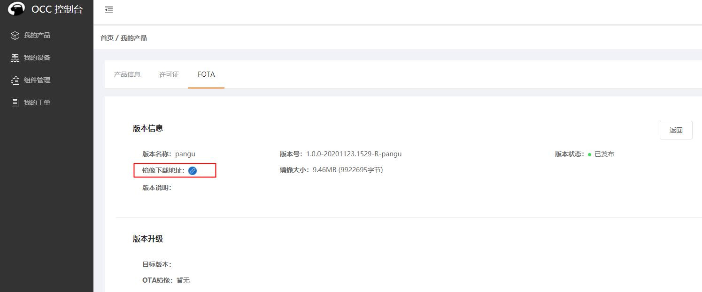

#### 烧写

下载下来的镜像放入generated目录，改名为images.zip

测试目录下创建一个.gdbinit，文件中放入如下内容:

```shell
target remote 172.31.0.196:1025
```

.gdbinit文件中的ip 地址从 CskyDebugServer 打印中获取, 连接 CskyDebugServer 步骤详情请见2.3节 。

测试目录下执行烧写命令：

```shell
make flashall
```


### 3.4 测试执行

#### 重启板子

烧录测试代码后，重启，看到打印Welcome to CLI...，说明已进入测试状态

```shell
Welcome to CLI...
> 
```


#### 网络连接

设置wifi ssid和密码

比如待连接的wifi账号是“TEST”,密码为“test1234”

```shell
kv set wifi_ssid TEST 
```

```shell
kv set wifi_psk test1234
```

 设置完毕重启开发板 

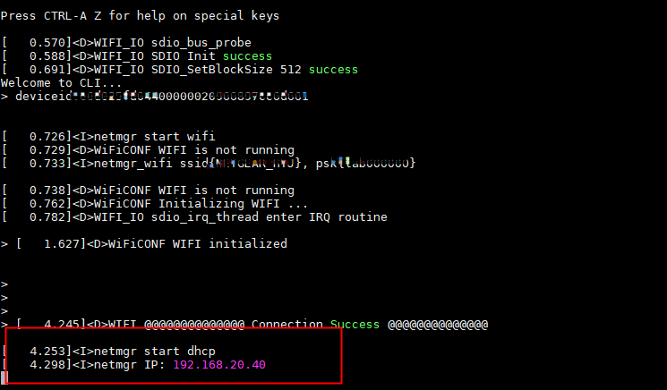

#### FOTA配置

下载许可证，下载文件中有表格


 系统默认60秒检查一次升级，升级需要进行如下配置 

```shell
设置设备ID 

kv set device_id id #id为下载下来的CID

设置产品类型 kv set model pangu 

若调整ota服务器，参考如下命令，默认就是如下URL 

kv set otaurl http://occ.t-head.cn/api/image/ota/pull
```


#### 发送指令进行测试

API测试：

通过串口软件发送api测试命令：

```shell
test fotaapi
```

串口终端会打印测试数据。

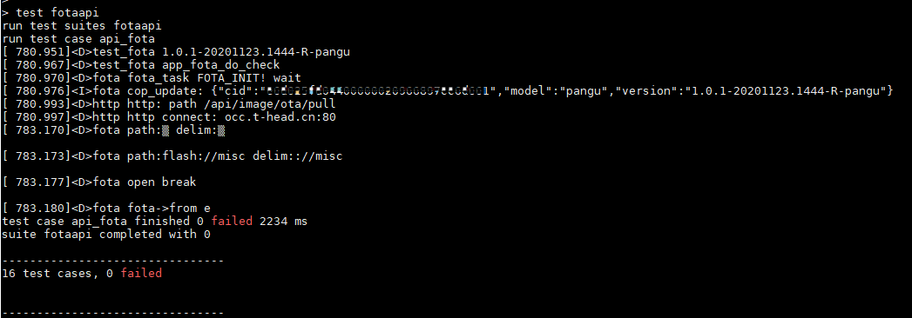

function测试：

通过串口软件发送api测试命令：

具体指令请参考：

```shell
Usage:  fota init #初始化
        fota start #开启检测
        fota stop  #完成下载进行升级
        fota set_auto_check 1|0 #开启/关闭自动检测
        fota check  #手动检测命令
```

串口终端会打印测试数据。

------

添加标签：

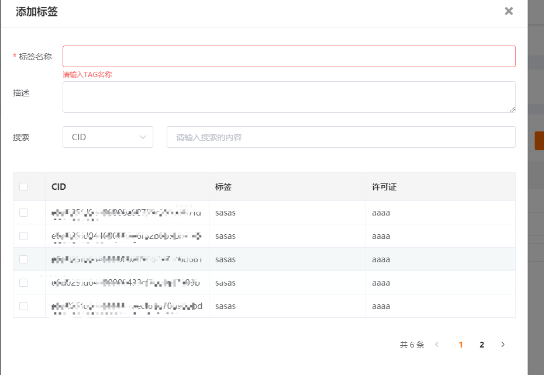

上传升级镜像，发布

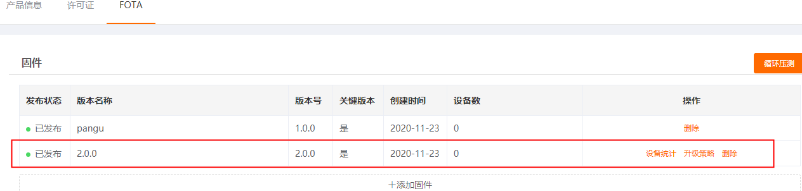

升级策略选中标签：

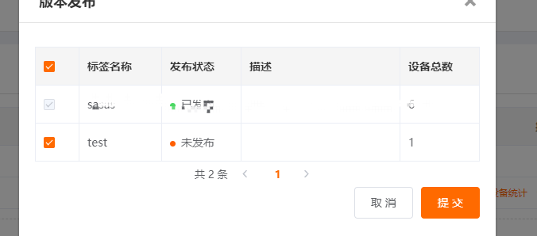

升级命令：

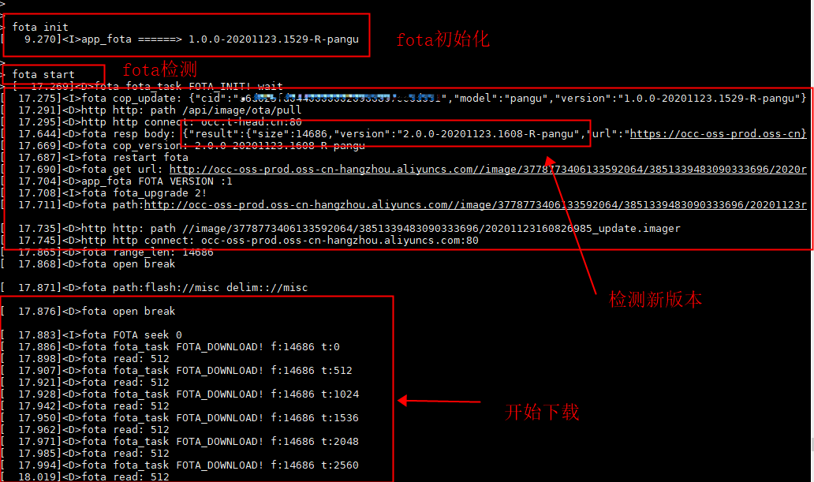

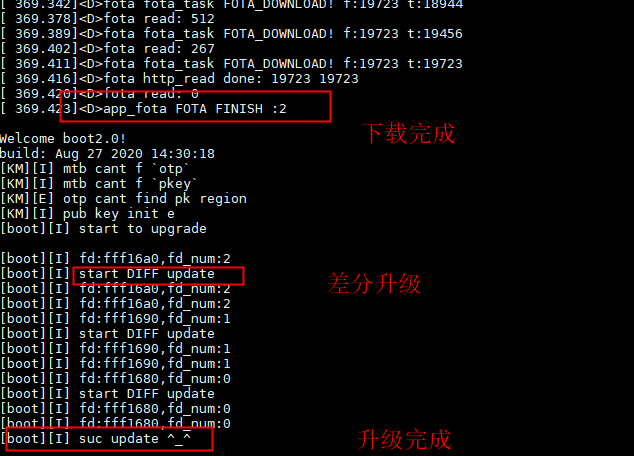