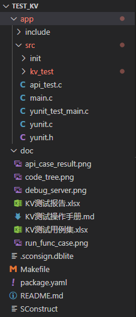
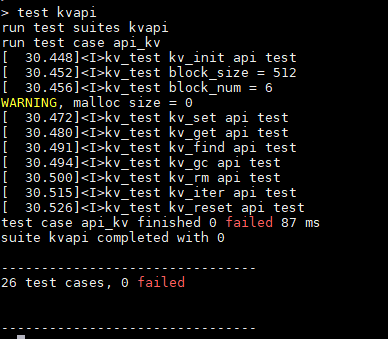
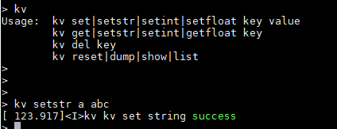

# KV测试操作手册

## 1. 概要

操作手册分为环境准备和测试KV两部分内容。环境准备主要介绍测试环境中所需的软硬件工具准备和安装。测试章节主要介绍程序编译及其编译前的准备工作，以及测试执行前的准备工作和执行中的具体操作步骤，明确具体的测试结果。

本操作文档以CB2201为例。


## 2. 环境准备

### 2.1硬件准备

| 设备   | 数量 | 功用                     |
| ------ | ---- | ------------------------ |
| PC     | 1    | 测试人员代码编写以及运行 |
| 开发板 | 1    | 测试对象                 |
| 串口线 | 2    | 烧写及查看log日志        |


### 2.2工具软件准备

| 软件名称        | 版本     | 功用   | 备注                                                         |
| --------------- | -------- | ------ | ------------------------------------------------------------ |
| 工具链          | V3.10.21 | 编译   | 下载命令 sudo yoc toolchain -c (下载和安装csky工具链)        |
| CskyDebugServer | V5.10.4  | 调试用 | https://www.xrvm.cn/community/download_detail?id=616215132330000384 |


### 2.3 开发板连接CskyDebugServer 

使用时，将串口和仿真接口通过数据线连接到电脑 USB 接口。在 windows 桌面双击打开 CskyDebugServer，连接开发板，连接成功会显示以下内容： 


## 3. 测试

**以CB2201为例。**

下载yoc代码。目录如下

```shell
mkdir temp  #创建目录
cd temp  
sudo pip install yoctools #安装yoctools，已经安装可以跳过
yoc init git@gitlab.alibaba-inc.com:thead_test_solutions/manifest.git #yoc环境初始化
yoc install test_kv  #下载test_kv
cd solutions/test_kv  #进入test_kv应用中
```

测试代码目录

 

### 3.1 package.yaml修改

**首先需要修改测试代码目录下的package.yaml。主要需要修改以下5处。**


#### 修改依赖board

 将solution字段的board_name改为实际测试的board组件。

```yaml
solution:
  board_name: cb2201                  //改为实际测试的board组件
```


#### 修改依赖组件

 将depends字段的cb2201改为实际测试的board组件，再添加实际测试需要依赖的组件。

以CB2201为例：

```yaml
depends:				//可在该字段下添加实际测试需要依赖的组件，此次使用的是7.4.0分支		
  - rhino: v7.4.0
  - aos: v7.4.0
  - cb2201: v7.4.0						//改为实际测试的board组件
  - console: v7.4.0
  - drivers: v7.4.0
  - kv: v7.4.0
  - minilibc: v7.4.0                         
```


### **3.2修改board初始化代码**

#### 分配kv分区

查看boards/cb2201/configs/config.yaml文件，用户需要进入自己的board中config.yaml

```yaml
soft_version: "v1.0"
mtb_version: 1
chip: cb2201        # cb2201 / cb6501
signature_type: RSA # RSA / ECC
digest_type: SHA256 # SHA1 / MD5 / SHA224 / SHA256 / SHA384 / SHA512
diff:
  ram_buf: 50      #DEC     KB   ( max ram need)
  flash_buf: 4     #DEC     KB   ( buffer size)
  flash_sector: 512 #DEC     byte ( flash sector)
  diff_mode: 010    #BIN

flash:
  sector: 512       # Bytes
  size: 262144      # $(sector count) * sector
partitions:

  - { name: imtb,    address: 0x10000000, size: 0x001000, update: NONE }
  - { name: tee,     address: 0x10001000, size: 0x005000, update: DIFF, verify: true }
  - { name: boot,    address: 0x10006000, size: 0x006000, update: NONE, verify: true }
  - { name: prim,    address: 0x1000C000, size: 0x028000, update: DIFF, verify: true }
  - { name: misc,    address: 0x10034000, size: 0x00AA00, update: NONE }
  - { name: kv,      address: 0x1003EA00, size: 0x000C00, update: NONE, verify: false } #kv分区
  - { name: lpm,     address: 0x1003F600, size: 0x000200, update: NONE }
```


#### 修改串口端口

查看 test_kv/app/src/init/init.c

```c
//配置测试用的串口端号
#define CONSOLE_IDX 0                 //实际所用的uart（串口打印）的index值
```


#### 初始化kv分区

```c
void board_yoc_init(void)
{
    board_init();
    event_service_init(NULL);
    uart_csky_register(CONSOLE_IDX);
    uart_csky_register(2);
    flash_csky_register(0);

    console_init(CONSOLE_IDX, 115200, 512);
    
    ulog_init();
    aos_set_log_level(AOS_LL_DEBUG);
    int ret = partition_init();
    if (ret <= 0) {
        LOGE(TAG, "partition init failed");
    } else {
        LOGI(TAG, "find %d partitions", ret);
    }
    
    aos_kv_init("kv");       //初始化kv分区
    
    utask_new("at&cli", 2 * 1024, QUEUE_MSG_COUNT, AOS_DEFAULT_APP_PRI);
    board_cli_init();

}
```


### 3.3 程序编译及烧写

#### 编译

测试目录下执行make命令编译程序：

```shell
make clean;make
```

编译成功后会在目录下的generated内生成images.zip。


#### 烧写

烧录之前我们有个准备工作需要做一下：

测试目录下创建一个.gdbinit，文件中放入如下内容:

```shell
target remote 172.31.0.196:1025
```

.gdbinit文件中的ip 地址从 CskyDebugServer 打印中获取, 连接 CskyDebugServer 步骤详情请见2.3节 。

测试目录下执行烧写命令：

```shell
make flashall
```


### 3.4 测试执行

#### 重启板子

烧录测试代码后，重启，看到打印Welcome to CLI...，说明已进入测试状态

```shell
Welcome to CLI...
> 
```


#### 发送指令进行测试

API测试：

通过串口软件发送api测试命令：

```shell
test kvapi
```

串口终端会打印测试数据。



function测试：

通过串口软件发送api测试命令：

具体指令请参考：

[命令介绍]: ../app/src/kv_test/README.md


```shell
Usage:  kv set|setstr|setint|setfloat key value
        kv get|setstr|setint|getfloat key
        kv del key
        kv reset|dump|show|list
```

串口终端会打印测试数据。

