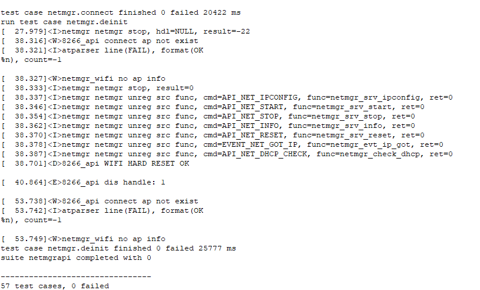
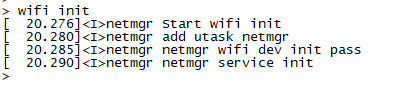
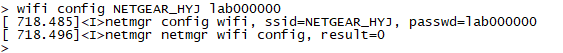
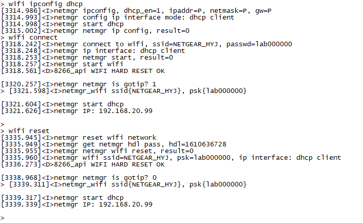
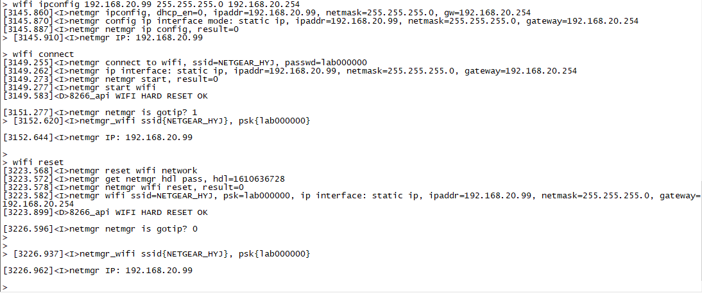
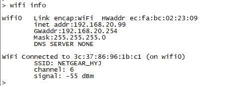
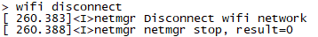
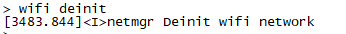

# NETMGR交付测试结果规范

### 1.API测试

请提交如下图所示的截图，57条case全通过的。

 

### 2.function测试

请提交7张截图，如下:

wifi init:

 

wifi config:

 

wifi connect with dhcp and reset:

 

wifi connect with static and reset:

 

wifi info:

 

wifi disconnect:

 

wifi deinit:

 