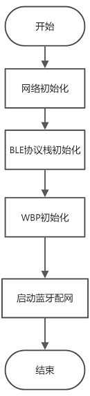
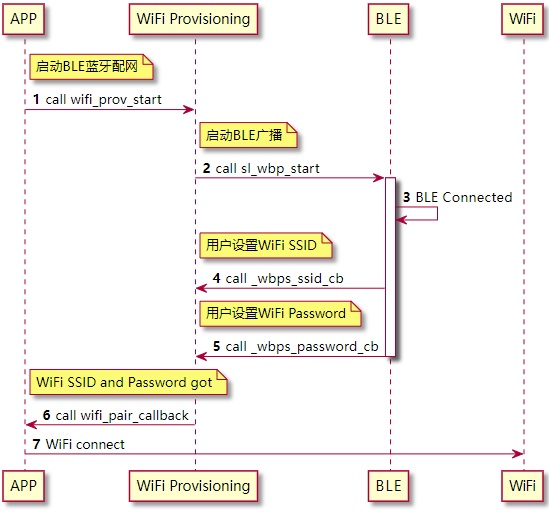
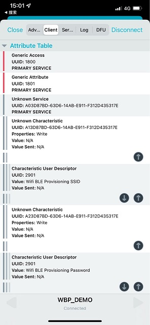
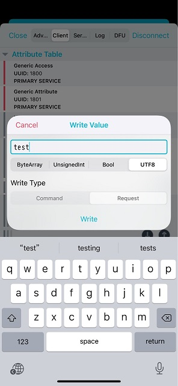

# 概述
WiFi作为一种常见的无线接入手段，在使用前需要配置SSID和Password。通过`wifi_provisioning`组件，开发者可以方便的实现多种配网方式。

常用的配网方式有：

- SoftAP 配网，通过设备上WiFi，生成一个临时网络，手机接入临时网络，完成配置
- BLE蓝牙配网，通过BLE 配置WiFi网络

其中BLE蓝牙配网方案，无论是成功率还是用户体验均优于SoftAP配网方案。

本文将实现一种BLE蓝牙配网方案，用于展示`wifi_provisioning`组件的适配和使用。

# 功能说明

本实例实现的BLE蓝牙配网方案主要实现以下功能：

- WBPS服务，私有的BLE GATT服务，用于实现WiFi SSID和Password的传输
- `wifi_provisioning`组件适配，用于支持新的配网方式
- BLE蓝牙配网，用于展示新增的配网方式如何使用

# 环境搭建

本实例程序可以运行在如下硬件平台：

| 平台名称 | 说明文档 |
| --- | --- |
| BL606P 开发板 | [开发板快速上手手册](https://yuque.alibaba-inc.com/iot_solution/lgipt8/boards_bl606p_bl606p_quick_start) |


# 代码解读

## WBPS服务

WiFi BLE Provisioning Service(WBPS) 是专门用于BLE蓝牙配网设计的私有GATT服务，服务定义如下

| Service Name | UUID |
| --- | --- |
| Wifi BLE Provisioning Service (WBPS) | A03D87BD-63D6-14AB-E911-F312D435317E |

| Characteristic Name | Characteristic Properties | Security | UUID |
| --- | --- | --- | --- |
| Wifi BLE Provisioning SSID | Write | NONE | A13D87BD-63D6-14AB-E911-F312D435317E |
| Wifi BLE Provisioning Password | Write | NONE | A23D87BD-63D6-14AB-E911-F312D435317E |


WBPS GATT 代码定义如下

```c
static gatt_attr_t wifi_ble_attrs[YOC_WIFI_BLE_IDX_MAX] = {
    [YOC_WIFI_BLE_IDX_SVC] = GATT_PRIMARY_SERVICE_DEFINE(WBPS_UUID),

    [YOC_WIFI_BLE_IDX_SSID_CHAR] = GATT_CHAR_DEFINE(YOC_WIFI_BLE_SSID_UUID, GATT_CHRC_PROP_WRITE),
    [YOC_WIFI_BLE_IDX_SSID_VAL]  = GATT_CHAR_VAL_DEFINE(YOC_WIFI_BLE_SSID_UUID, GATT_PERM_READ | GATT_PERM_WRITE),
    [YOC_WIFI_BLE_IDX_SSID_DES]  = GATT_CHAR_CUD_DEFINE(ssid_char_des, GATT_PERM_READ),

    [YOC_WIFI_BLE_IDX_PWD_CHAR] = GATT_CHAR_DEFINE(YOC_WIFI_BLE_PWD_UUID, GATT_CHRC_PROP_WRITE),
    [YOC_WIFI_BLE_IDX_PWD_VAL]  = GATT_CHAR_VAL_DEFINE(YOC_WIFI_BLE_PWD_UUID, GATT_PERM_WRITE),
    [YOC_WIFI_BLE_IDX_PWD_DES]  = GATT_CHAR_CUD_DEFINE(pwd_char_des, GATT_PERM_READ),
};
```

## `wifi_provisioning`适配

1. 注册Wifi Provisioning 开始和停止配网接口

```c
static wifi_prov_t wifi_ble_priv = {
    .name  = "wifi_ble_prov", /* wifi-provisioning method name */
    .start = sl_wbp_start,    /* wifi-provisioning start function porting */
    .stop  = sl_wbp_stop,     /* wifi-provisioning stop function porting */
};

int main ()
{
    ...
    /* registe the wifi-ble provisioning method to wifi-provisioning component */
    ret = wifi_prov_method_register(&wifi_ble_priv);
    ...
}
```

2. 开始配网服务适配

启动BLE蓝牙广播，广播内容为WBPS UUID

```c
static int sl_wbp_start(wifi_prov_cb cb)
{
    int ret;

    LOGD(TAG, "sl wbp start");

    ad_data_t ad[2] = { 0 };

    uint8_t flag = AD_FLAG_GENERAL;

    ad[0].type = AD_DATA_TYPE_FLAGS;
    ad[0].data = (uint8_t *)&flag;
    ad[0].len  = 1;

    ad[1].type = AD_DATA_TYPE_UUID128_ALL;
    ad[1].data = (uint8_t *)UUID128(WBPS_UUID);
    ad[1].len  = sizeof(UUID128(WBPS_UUID));

    adv_param_t param = {
        ADV_IND, ad, NULL, BLE_ARRAY_NUM(ad), 0, ADV_FAST_INT_MIN_2, ADV_FAST_INT_MAX_2,
    };

    ret = ble_stack_adv_start(&param);

    wifi_info.prov_cb = cb;

    return ret;
}
```

3. 停止配网服务适配

停止蓝牙广播

```c
static void sl_wbp_stop()
{
    LOGD(TAG, "sl wbp stop");

    ble_stack_adv_stop();

    return;
}
```

## BLE 蓝牙配网

1.  启动流程  
  
2.  配网流程  

# 例程运行
1.  编译烧录`wifi_ble_provisioning_demo`
2.  开发板上电，连接串口 
3.  使用手机，安装NRF Connect App，扫描设备名称为"WBP_DEMO"  
  
4.  点击Connect，发现WBPS服务，其中  

Characteristics A13D87BD-63D6-14AB-E911-F312D435317E 用于SSID输入

Characteristics A23D87BD-63D6-14AB-E911-F312D435317E 用于Password输入  




5. 分别点击Characteristics A13D87BD-63D6-14AB-E911-F312D435317E和 A23D87BD-63D6-14AB-E911-F312D435317E的向上箭头，输入SSID和Password。
注意SSID和Password应当以字符串格式输入，类型需要选择UTF8  


    

6. 在串口，可以查看到日志，WiFi开始连接网络，获取IP

```bash
[ 129.796]<D>[APP]<prov_result>wifi pair got, ssid:test passwd:test
[ 129.802]<I>[netmgr]<netmgr>start wifi
...
[ 136.604]<I>[netmgr]<netmgr>IP: 192.168.50.96
```

# 组件API 介绍

参考：

- [ble_host](https://gitee.com/yocop/ble_host/blob/master/docs/ble_api/BLE_API.md)
- [wifi_provisioning](https://gitee.com/yocop/wifi_provisioning/blob/master/README.md)
- [netmgr](https://gitee.com/yocop/netmgr/blob/master/README.md)
